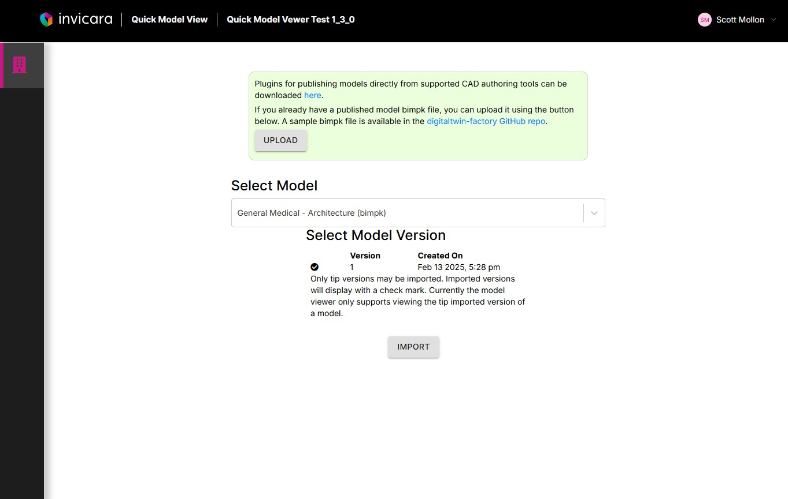
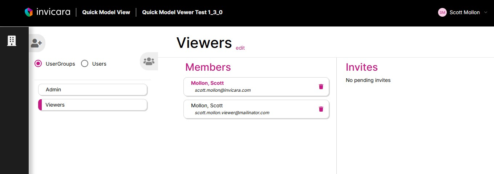

# Quick Model View Twinit Application Template

Release: 2.0.0

The Quick Model View Twinit Application Template provides an easy to learn,  easy to deploy, easy to use, and easy to extend model viewing application utilizing the capabilities Twinit provides for importing and viewing models imported using supported CAD authoring or file types. This template is also a good place to start if you are looking for a first step toward using and deploying other more complex templates or if you plan to develop your own templates.

> **Note**: The Quick Model View Twinit Application Template requires that you have a valid Twinit account and that you are capable of running a React web client locally and/or deploying a React web client for your users. **As such it is mandatory that you have completed the Self-Led Developer training courses, including the React UI courses, on [Twinit Academy](https://academy.twinit.io/) prior to attempting to implement the Quick Model View Twinit Application**

## Features currently included in this application template include:

| | |
| --------------- | -------------------|
| Create new and update existing Quick Model View projects with the click of a button |  |
|  |  Import multiple CAD models to your Quick Model View projects |
| View your imported models and review the properties on model elements you select in the viewer. Download element reports to Excel. |  |
|  | Collaborate with other users by inviting them to your Quick Model View projects |

Be sure to check back often as new features and capabilities will be added to the template over time.

## Materials included in the template are:

* A React web client that you can build and deploy to provide a user interface for the Quick Model View Application
* A Quick Model View Application Manager to allow you create new Quick Model View projects for users and to update existing Quick Model View projects to the latest released version
* All the script and user config templates needed to setup and extend both the Quick Model View Manager and the Quick Model View applications and user interface.

Two sets of documentation have also been provided:

* A [Developer Guide](./docs/developer%20guide/README.md) providing instructions on how to deploy the Quick Model View application to Twinit and to build and deploy the template web client. The Developer Guide also includes explanations of how the Quick Model View Twinit Application works, the Twinit services it makes use of, the data model it puts in place, and where to start if you wish to make some common extensions to the code.
* A [User Guide](./docs/user%20guide/README.md) providing instructions on the usage of the Quick Model View Twinit Application.

## Getting Started

* **If you are developer** looking to deploy the template for your users or to learn how a Twinit Application template works, start with the [Developer Guide](./docs/developer%20guide/README.md) to get started with deploying the template and learning about the implementation behind it.
* **If you are a user** looking for training and guidance on using the template that a developer has deployed for you, start with the [User Guide](./docs/user%20guide/README.md) where you can learn how to upload and view models and how to invite other users to participate in your Quick Model View projects.

## Release Notes

Detailed release notes for each release of the Quick Model View Application Template are available on the [Release Notes page](./docs/release-notes.md)