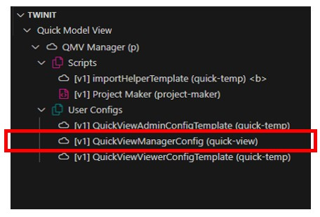
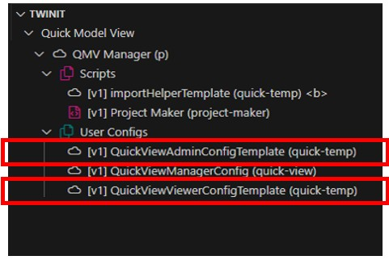
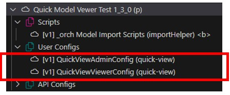

# Change the Logo in the Web Client

The template provides a default Invicara logo for the web client. This logo appears in both the QMV Manager and Quick Model View user interface and can be changed in each independently.

## Change the Logo

The logo can be changed by editing the user config templates in the QMV Manager project, editing the QMV Manager user config, or editing the user configs in existing Quick Model View projects.

To change the logo you will add information to the "settings" in each user config. Specifically you will modify the "appImage" setting.

```json
"appImage": {

}
```

The "appImage" setting can provide a new logo image via a URL .

To use a URL for an image:

```json
"appImage": {
   "url": "https://url.to.my/logo_file.png"
}
```

## Where to Make Logo Changes

There are potentially three places you will need to make the setting change to display a different logo depending on where you want the logo to appear.

### QMV Manager User Interface

If you wish the new logo to appear in the QMV Manager user interface, you'll need to modify the QuickViewManagerConfig in the "QMV Manager" project.



### Newly Created Quick Model View Projects

If you wish the new logo to appear in newly created Quick Model View projects, you'll need to modify the QuickViewAdminConfigTemplate and QuickViewViewerConfigTemplate in the "QMV Manager" project.



### Existing Quick Model View Projects

If you wish to update existing Quick Model View projects to display the new logo, you'll need to modify the QuickViewAdminConfig and QuickViewViewerConfig in each of the existing projects.



> This could be done by creating a custom migration and running these updates through the Project Maker pageComponent UI, but you will need to be careful when consuming future template updates.

---
[Developer Guide](../README.md) < Back