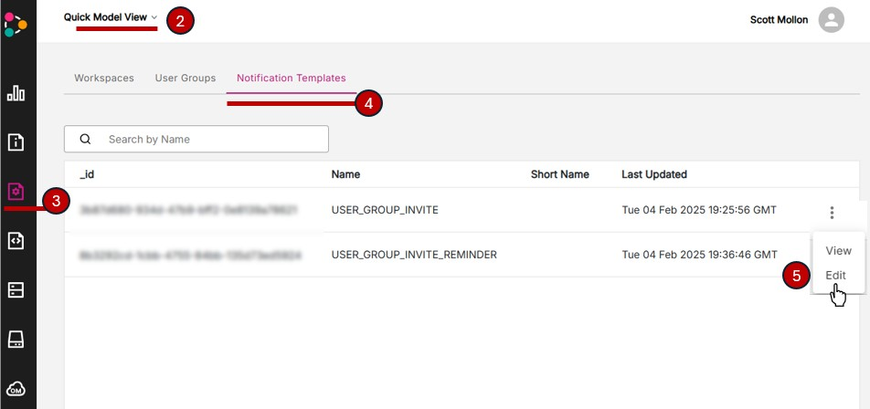
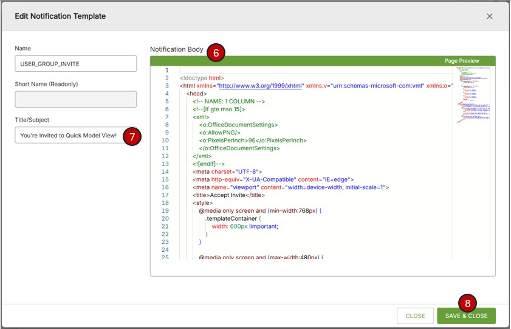
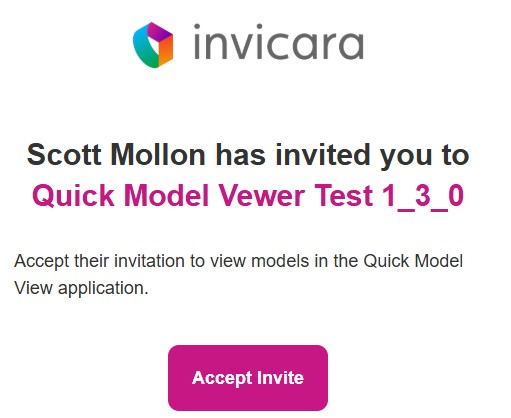

# Customize Your Email Invitations

All new applications on Twinit receive the same default email invitation templates. By necessity this template is very generic and may be confusing to users receiving them if they are expecting an invitation from the Quick Model View application.

You can customize the email invitations for your application by simply providing updated html.

## Update Your Email Invitation Templates

> These same steps are also available in the "Twinit Self-Led Developer Training Advanced" course on [Twinit Academy](https://academy.twinit.io/enrollments).

### Sample Invite Templates

The Quick Model View Application Template includes a set of sample email invites you can use in the following steps. They are located in the [setup folder](../../../setup/_email%20templates).

### Open the Twinit Console

1. Sign in to the Twinit console for the environment you are using
   * [Twinit Sandbox](https://sandbox.invicara.com/console)
   * [Twinit Production](https://apps.invicara.com/console)
   * If you are working with a self-managed instance of Twinit you'll have your own custom console URL
2. Select your application
3. Select the Passport Service page
4. Click the Notification Templates tab
5. Click the menu for the USER_GROUP_INVITE template and click Edit

6. Paste the contents of [inviteTemplate.html](../../../setup/_email%20templates/inviteTemplate.html) into the Notification Body field.
7. Change the Title/Subject to be "You're Invited to Quick Model View!"
8. Click the "Save and Close" button

9. Repeat steps 5 through 8 for the USER_GROUP_INVIT_REMINDER, copying he content of [inviteReminderTemplate](../../../setup/_email%20templates/inviteReminderTemplate.html) into the notification body and setting the Title/Subject to "A Reminder to Join Quick Model View".

Invites sent through the User Groups page in the application will look like this.

You can also make any further updates or changes to the notification body and they will be reflected in the invitations sent afterward.

> See the "Twinit Self-Led Developer Training Advanced" course on [Twinit Academy](https://academy.twinit.io/enrollments) for more information on how you can further customize and modify the invite emails.

---
[Developer Guide](../README.md) < Back