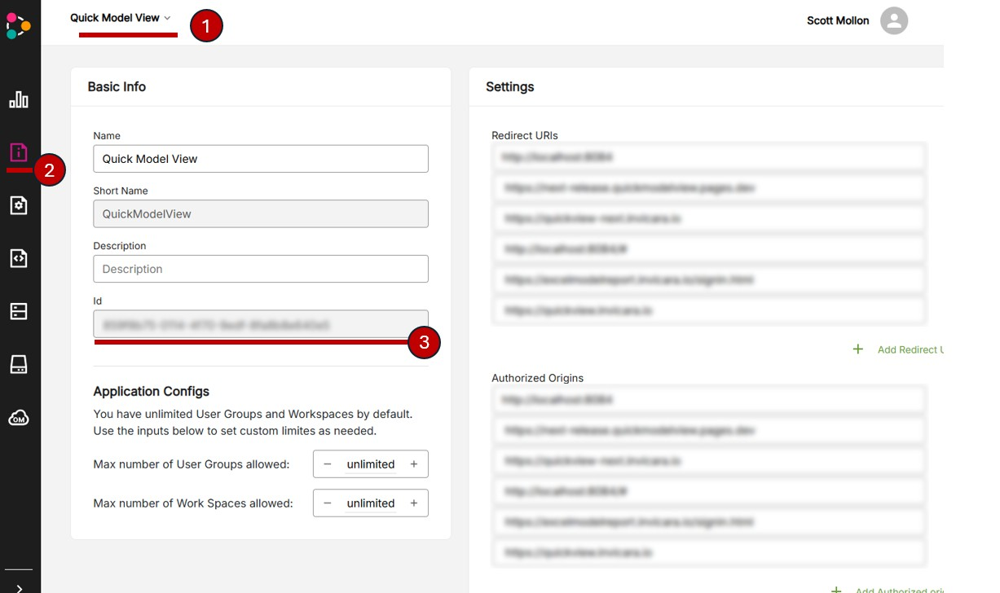
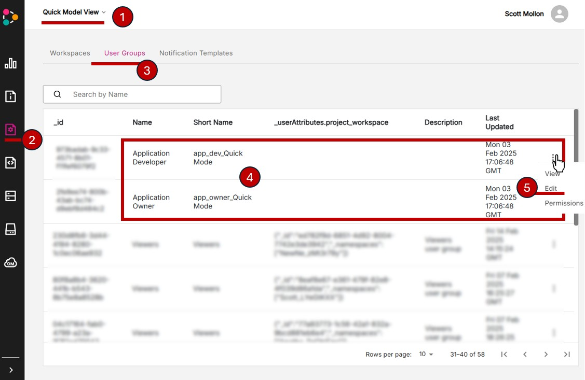
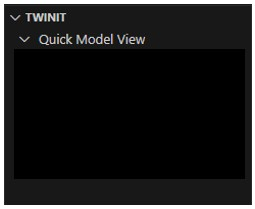

[Developer Guide](../README.md) < Back | **Next** > [Deploy the Application Template to Twinit](./d2-deploy-twinit.md)

---

# Deploy Step 1: Gather Necessary Info and Check Twinit Access

> **Note**: Be sure you have read [the General Introduction](../implementation/general-intro.md) before continuing.

The first step to deploying the template is to make sure you have the necessary information and access to successfully deploy the template. You will need:

* To know what Twinit instance on which you will be deploying the template
* Your Twinit Application ID
* To be a member of the Application Developer or Owner user groups for your Application ID
* To configure your Twinit VS code Extension for your application ID and Twinit instance

## Find your Twinit Instance

First, you will need to know on which instance of Twinit you will be working. You'll use the URL for the Twinit instance's API in a number of steps while configuring and deploying the template.

In most cases, if you are just starting out and deploying a template for the first time, you will be working on Twinit Sandbox. If you are ready to deploy a production version of the template, you're most likely to do so on Twinit Production.

**Twinit Sandbox Info**

* Name: Twinit Sandbox
* API URL: https://sandbox-api.invicara.com
* Console Application URL: [https://sandbox.invicara.com/console](https://sandbox.invicara.com/console)

**Twinit Production Info**

* Name: Twinit Production
* API URL: https://api.invicara.com
* Console Application URL: [https://apps.invicara.com/console](https://apps.invicara.com/console)

>**Note**: Clicking on the API URLs will not take you a Twinit user interface. The API URLs are where the Twinit API is served and through which you will communicate with the individual Twinit Service's REST APIs.

If you are using a self-managed instance of Twinit you will have your own set of custom URLs for your instance.

## Finding Your Application ID

When your organization was issued its Twinit Application ID, a user at the organization was identified as an Application Owner. This will be someone in your organization who has the ability to administer your applications and user groups. This person will have also been issued a Twinit Application ID.

If this person is not you, contact them and ask them for your organization's Twinit Application ID. Keep your application ID on hand as it will be needed in multiple places when deploying and configuring the template and its web client.

If you cannot find your assigned Twinit Application Owner or do not know who it is, contact [Twinit Developer Support](https://developer-support.twinit.com/support/home) and they can help you identify the Application Owner.

If your Application Owner does not have your application ID, it can be retrieved by:

1. Signing in to the Twinit console for the Twinit environment you are using and select your Application:
   1. [Twinit Sandbox](https://sandbox.invicara.com/console)
   2. [Twinit Production](https://apps.invicara.com/console)
   3. If you are working with a self-managed instance of Twinit you'll have your own custom console URL
2. Selecting the Application Details page
3. Copying the Id from the application's Basic Info section



> **Note**: Your application will not likely have a name other than Quick Model View.

## Getting Access as an Application Owner or Application Developer

When speaking with you Application Owner, you'll also want to ask that you are, at a minimum, a member of your application's Application Developer user group.

Alternatively, your application owner could also add you to the Application Owner user group. When you are ready to deploy the template's web client to the cloud, you'll need to make changes to your application's Allowed Redirects and Authorized Origins. These changes can only be made by an Application Owner. If you are made a member of the  Application Owner user group, you will be able to change these configuration changes without the help of your Application Owner.

Your application admin can add you to these group by:

1. Signing in to the Twinit console for the Twinit environment you are using and select your Application:
   1. [Twinit Sandbox](https://sandbox.invicara.com/console)
   2. [Twinit Production](https://apps.invicara.com/console)
   3. If you are working with a self-managed instance of Twinit you'll have your own custom console URL
2. Selecting the Passport Service page
3. Selecting the User Groups tab
4. Finding the Application Developer and Application Owner user groups
5. Opening the menu for the use to which to add you and selecting "Edit"
6. You can then be added to the user groups using the "Invite and remove users" tab in the dialog "View and edit" dialog



> **Note**: Your application will not likely have a name other than Quick Model View.

## Configure Your Twinit VS Code Extension

> **Before Continuing**: Make sure you have the latest version of the Twinit VS Code Extension installed. If a newer version of the extension is available you will be prompted to download and install it when you start VS Code. It is important to always use the latest extension.

As part of the Self-Led Developer courses on Twinit Academy, you configured your Twinit VS Code Extension to connect to Twinit Sandbox. You can follow the same steps to add the Twinit Production instance (if needed) or your self-managed instance.

You may also need to add your application ID to your Twinit VS Code extension configuration as well.

Instructions on how to do both, if you need a refresher, are available on [twinit.dev](https://twinit.dev/docs/marketplace/Tools/vscode-ext-docs/getting-started).

**Do not proceed on to the next step unless you can sign into Twinit and your application through the Twinit VS Code extension.** You should be able to see something similar to the image below with your application's name displayed in the extension panel.



## Clone the Template Code Local

1. Using the tool of your choice, clone this GitHub repo locally to your system.

If using the git command line, run the following from the directory in which you want to clone the repository:

```git clone https://github.com/Invicara/Twinit-App-Template-Quick-Model-View```

For more help on cloning repositories, refer to [GitHub Docs](https://docs.github.com/en/repositories/creating-and-managing-repositories/cloning-a-repository).

## Next Steps

In the previous steps you have collected all the information and access you will need to successfully deploy and use the template.

In the next step you will deploy the template scripts, user configs, and template configurations to a new Twinit project.

---
[Developer Guide](../README.md) < Back | **Next** > [Deploy the Application Template to Twinit](./d2-deploy-twinit.md)