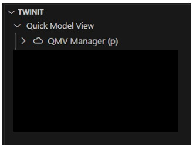
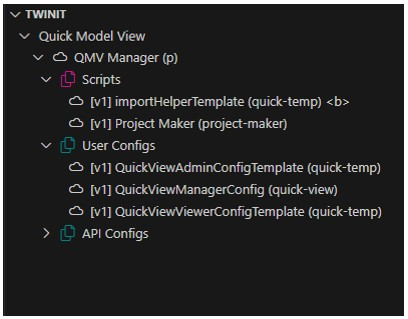

[Gather Necessary Info and Check Twinit Access](./d1-gather.md) < Back | **Next** > [Build and Run the Web Client](./d3-webclient.md)

---

# Deploy Step 2: Deploy the Application Template to Twinit

Next you will deploy the template and its configuration to Twinit. This is the first of two deploys to completely deploy the template. In a later step you will learn how to build and deploy the template's web client.

To deploy the template to Twinit you will:

1. Clone the template code locally
2. Sign in to Twinit and your application using the Twinit VSCode Extension
3. Create a new "Quick Model View Manager" project for your application
4. Upload the scripts, configurations, and template configurations to your new project
5. Create an Admin user group for your "Quick Model View Manager" project
6. Assign the Quick Model View Manager user config to the new Admin user group

Remember, as mentioned in the [General Introduction](../implementation/general-intro.md), what you are setting up now is the ability to create new Quick Model View projects, not actually creating new Quick Model View projects themselves.

## Sign in to Your Application using the Twinit VS Code Extension

1. Sign in to Twinit using the Twinit VS Code extension
2. Select the Twinit instance in which you be working when prompted
3. Select your application when prompted

Your Twinit extension panel should look like this, with your application name displayed.


## Create a New "Quick Model View Manager" project

1. Right click on your application name in the Twinit extension and select "New Project"
2. Enter "QMV Manager" when prompted for a project name
3. Enter "QMV Manager" when prompted for a project description
4. Enter "qmvman" when prompted for a project short name

A new project should now be visible in the extension panel.



## Upload the Scripts, Configurations, and Template Configurations

1. Expand your new "QMV Manager" project in the extension panel
2. Right click on the Scripts folder and select "Bulk Load Scripts"
3. When prompted for a Script Info file, navigate to the directory in which you have saved the template code, and select ```setup/scriptInfo.json```
4. When prompted to select script files, navigate to the directory in which you have saved the template code, and select all the ```.mjs``` files in ```setup/scripts```
5. Once the script upload has completed, the panel will refresh and scripts will be displayed in your Scripts folder
6. Right click on the User Configs folder ad select "Bulk Load Configs"
7. When prompted for a Config Info file, navigate to the directory in which you have saved the template code, and select ```setup/configInfo.json```
8. When prompted to select config files, navigate to the directory in which you have saved the template code, and select all the ```.json``` files in ```setup/configs```
9. Once the config upload has completed, the panel will refresh and configs will be displayed in your User Configs folder



## Create an Admin User Group

1. Right click on your "QMV Manager" project in the extension panel and select "Create a Project Admin Group"
2. When prompted replace the name "Admin" with "QMV Managers" 

You'll see a notice in the bottom right corner of the VS Cod window once the new QMV Managers Admin user group has been created.

## Assign the Manager User Config

1. Right click on the "QuickViewManagerConfig (quick-view)" user config in your project, and select "Relate Config to User Group"
2. Select the "QMV Managers" user group when prompted

You'll see a notice in the bottom right corner of the VS Code window once the user config has been related to the user group.

## Next Steps

In the previous steps you deployed the Quick Model View Manager configuration and scripts to Twinit along with the template script and user configurations it needs to create new Quick Model View projects.

In the next step you will build and run the template web client.

---
[Gather Necessary Info and Check Twinit Access](./d1-gather.md) < Back | **Next** > [Build and Run the Web Client](./d3-webclient.md)