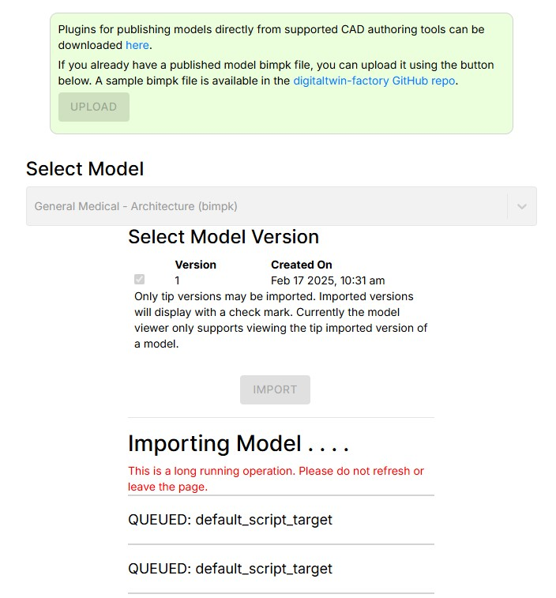
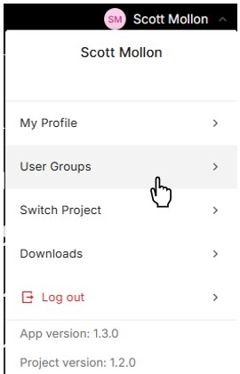

[Build and Run the Web Client](./d3-webclient.md) < Back | **Next** > [Deploy the Web Client for Users](./d5-deploy-to-cloud.md)

---

# Deploy Step 4: Test the Template

Now that you have deployed the template to Twinit and have the template web client running locally, we'll test that everything is functioning correctly.

To do so we will:

1. Sign in to the "QMV Manager" project
2. Use the "QMV Manager" project to create a new Quick Model View project
3. Sign in to the newly created Quick Model View project
4. Upload and import a sample model
5. View the imported model
6. Test the Viewer User Group

## Sign In to the "QMV Manager" Project

1. If the web client is not already running, open a terminal window in the directory in which you copied the template code and run ```npm run watch```
2. If not already signed in, sign in to Twinit when the web client redirects you to do so
3. When the Project Selection dialog appears select the "QMV Manager" and click "Load Project"


You be automatically routed to the Project Maker pageComponent.


## Create a New Quick Model View Project

1. Enter "Test QMV Project" in the "New Project Name" text field
2. Click the "Create Project" button

As the project is being created, you'll see updates in the creation log for each step that successfully completes. If an error is encountered at ay time, the log will display the error and print more information about the error to the browser console.

Once the log displays "New project creation complete!" you'll see the list of projects on the right side of the update to display your new project.


## Sign In the New Quick Model View Project

1. From the header menu select "Switch Project"


2. When the Project Selection dialog appears select the "Test QMV Project", the Admin User Group, and click "Load Project"


## Upload and Import a Sample Model

1. From the navigation bar on the left side of the user interface select the "Model Import" page


2. On the model import page download the sample model (bimpk) file from the digitaltwin-factory sample files


3. Once the file is downloaded, click the Upload button and select the sample file; the upload button will display the files upload progress
4. Once the file is completely uploaded it will appear in the Select Model, though sometimes a page refresh is necessary
5. Check the box for version 1 of the model bimpk and click the Import button; an impot log will display showing the status of the import orchestrator steps



The status of each task will change from QUEUED to RUNNING to COMPLETE as the orchestrator runs. Once all tasks are COMPLETE the import will have succeeded.


## View the Imported Model

1. From the navigation bar on the left side of the user interface select the "Model View" page


2. Select the sample model in the "Select a Model" dropdown and the model should load in the viewer
3. Click on an element in the model and the element data should display


##  Test the Viewer User Group

So far, you've done all testing as a member of the Admin User Group. Next we'll need to make sure that members of the Viewers User Group can also view and interact with the model.

To to do this you will need to create a new test user. You can't simply switch the Viewers User Group with your user. Recall in the Twinit Academy training that permissions in Twinit are **cumulative**. So even though you may choose to interact with the web client as a Viewer, all requests to Twinit would be authorized on your cumulative **Admin and Viewer** permissions. Meaning testing with your user would never test if the read-only permissions assigned to Viewers work correctly.

There are a number of ways to create a test user. These steps will use mailinator.com as a disposable email inbox service for the test user, but if you have other ways please feel free to use them.

> **Note**: Mailinator.com allows for creating temporary public email inboxes that can receive emails sent to any mailinator.com email address. Emails sent to public Mailinator email inboxes are automatically deleted after a few hours if you do not delete the emails first. However, Mailinator public inboxes can be found by anyone who knows the email address you used. So if you are using a confidential model to test the application, you may wish to use a different method to create a test user.

1. In the header menu select "User Groups"



2. On the User Groups page expand the "Send Invites" panel
3. Select the "Viewers" User groups in the "Select UserGroups" dropdown
4. Enter any email, but one you will remember, ending in "@mailinator.com" in the email field
5. Click Add Email
6. Click Send Invites


7. After the invite has been sent, log out of Twinit


8. Open a browser tab to [https://mailinator.com](https://mailinator.com)
9. Using the input at the top of the Mailinator page search for he email address to which you sent the invitation
10. Open the invitation email and follow the process to create the new test user account on Twinit
11. After signing in as the new user, the invitation to the Viewers User Group will appear in the Project Select dialog
12. Click Accept on the invite, select the "Test QMV Project" when he project dropdown appears, and click the "Load Project" button


13. Select the sample model in the "Select a Model" dropdown and the model should load in the viewer
14. Click on an element in the model and the element data should display

## Next Steps

Congratulations, you have successfully deployed and tested the Twinit template and web client.

If you are interested in learning how to build and deploy the template web client for other users to use, continuing on to the next step. Otherwise, return to the [Developer Guide](../README.md) to continue learning more about the template.

---
[Build and Run the Web Client](./d3-webclient.md) < Back | **Next** > [Deploy the Web Client for Users](./d5-deploy-to-cloud.md)