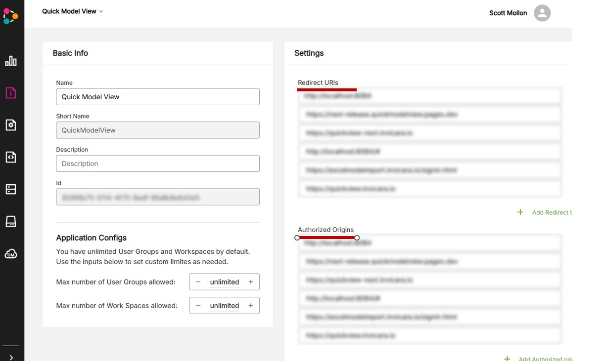

[Test the Template](./d4-test.md) < Back | **Return to** > [Developer Guide](../README.md)

---

# Deploy Step 5: Deploy the Web Client for Users

Now that you have a working web client, you'll want to deploy it for users.

To do so, you will need to:

1. Build the static web client files
2. Deploy the static files to a web hosting service

## Build the Static Web Client Files

1. Open a terminal window in the directory in which you cloned the template code
2. Run ```npm run build```

This will use Webpack to build deployable static files in the ```./build``` folder. If you wish to modify the webpack config, you can do so in the ```webpack.prod.js``` file.

In the ```./build``` folder there are two files you will need to modify as part of your build process.

* config.js : This file will be a copy of ```app/public/config.js```. If you wish to point the built version to a different instance of Twinit, you will need to create a ```./build/config.js``` file with the appropriate endpointConfig. Additionally, you will need to replace the "baseRoot" with the URL where the web client will be hosted.
* version.js : This file will be a copy of ```app/public/version.js``` and contains the version number (and any other info you wish to include) that will be displayed by default in the web client header menu.

## Deploy the Static Files to a Web Hosting Service

Twinit does not host or serve web clients, so you will need to host the web client yourself or use a hosting service. [Here are some free options listed on hostingadvice.com](https://www.hostingadvice.com/how-to/best-static-web-hosting/#free).

Whichever option you choose, you'll deploy the contents of the ```./build``` to the service.

**Don't forget**, once you deploy the web client, you'll need to update your application's Allowed Redirects and Authorized Origins with the URL at which you are serving the web client. Failing to do so will result in your users seeing a redirect error after signing in to Twinit.



> **Note**: Your application will not likely have a name other than Quick Model View.

## Next Steps

You have completed the deployment guide.

Return to the [Developer Guide](../README.md) to continue learning more about the template.

---
[Test the Template](./d4-test.md) < Back | **Return to** > [Developer Guide](../README.md)