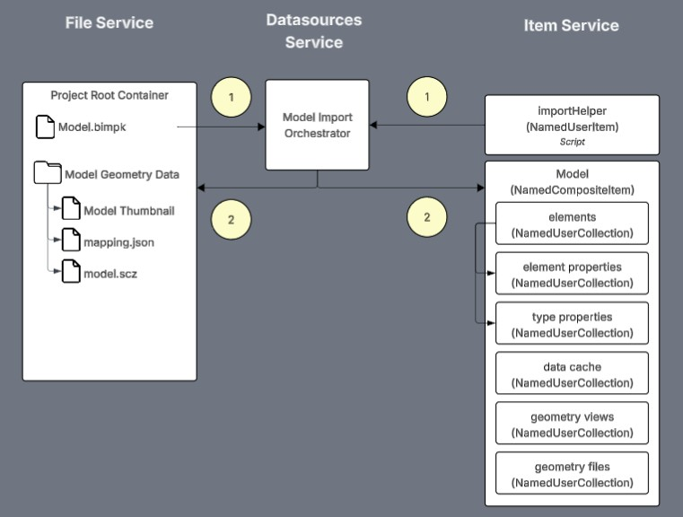

# Imported Model Data

## Importing Models

For more on importing models and the resulting data model please review the "Twinit Self-Led Developer Training Intermediate" course on [Twinit Academy](https://academy.twinit.io/enrollments).



The model import process involves:

1. The import orchestrator reading the bimpk from the Twinit File Service and using the importHelper script from the Twinit Item Service
2. The import orchestrator writing model graphics data to the Twinit File Service and model element, property, relationship, and reference data to the Twinit Item Service.

> You can read more about the bimpk file format on [twinit.dev](https://twinit.dev/docs/concepts/plug-ins/bimpk-spec/bimpk-file).

## Imported Model Item Service Data

An imported model is represented in the Twinit File Service as a NamedCompositeItem. NamedCompositeItems that contain model data can be identified by the _userType "bim_model_version".

Here is an example model NamedCompositeItem:
```json
{
  "_uri": "/nameduseritems/67a3*********fd82c4",
  "_name": "General Medical - Architecture",
  "_userType": "bim_model_version",
  "_tipId": "67a3c********d82c5",
  "_versions": [
    {
      "_userAttributes": {
        "thumbnail": {
          "fileVersionId": "4b994723********62040305d095",
          "fileId": "e6b83386********0c689cd69554"
        },
        "bimpk": {
          "fileVersionId": "92c400dc********e4d2bb0558bc",
          "fileId": "d5d9f888********ab8365df752b"
        },
        "model": {
          "source": "IFC; Version: Ifc2X3",
          "originalSource": "ID: Revit; Name: Autodesk Revit 2020 (ENU); Ver: 2020; Dev: Autodesk Revit 2020 (ENU)"
        }
      },
      "_userItemDbId": "67a3c7*******d82c4",
      "_id": "67a3c7********fd82c5",
      "_isTip": true,
      "_metadata": {
        "_updatedById": "517d6da6********8ed69e70a7a5",
        "_createdAt": 1738786800029,
        "_createdById": "517d6da6********8ed69e70a7a5",
        "_updatedAt": 1738786998711
      },
      "_version": 1
    }
  ],
  "_irn": "itemsvc:nameduseritem:67a3c7********fd82c5",
  "_namespaces": [
    "genmed_fDKcbraA"
  ],
  "_nextVersion": 2,
  "_shortName": "General Med A",
  "_tipVersion": 1,
  "_versionsCount": 1,
  "_itemClass": "NamedCompositeItem",
  "_userItemId": "gen_med_modelver_hD79rfWvQQ",
  "_id": "67a3*********fd82c4",
  "_description": "BIM model version by transform",
  "_metadata": {
    "_updatedById": "517d6da6*********8ed69e70a7a5",
    "_createdAt": 1738786799953,
    "_createdById": "517d6da6*********8ed69e70a7a5",
    "_updatedAt": 1738786799953
  },
  "_kind": "collection"
}
```

You can query for model NamedCompositeItems like so:

```js
// get NamdCompsiteItems representing imported models
let importedModelComposites = await IafProj.getModels(currentProject)
```

Each model NamedCompositeItem is related to a number of NamedUserCollections. The three containing model element data are:

* Element Collection
* Element Properties Collection
* Element Type Properties Collection

You can query for the NamedUserCollections related to a NamedCompositeItem like so:

```js
// get collections contained in the NamedCompositeItem representing the model
let collectionsModelCompositeItem = (await IafItemSvc.getRelatedInItem(selectedModelComposite._userItemId, {}))._list
```

### Element Collection

The element collection contains items that represent each element in the model. You can identify the element collection by the _userType "rvt_elements".

Here is an example model element item:
```json
{
  "relationships": {},
  "revitCategory": {
    "val": "OST_Furniture",
    "dVal": "Furniture",
    "name": "REVIT_CATEGORY",
    "dName": "Revit Category",
    "id": 2631,
    "srcType": "STRING"
  },
  "revitFamily": {
    "val": "Chair-Executive",
    "name": "REVIT_FAMILY",
    "dName": "Revit Family",
    "id": 2632,
    "srcType": "STRING"
  },
  "revitType": {
    "val": "Chair-Executive",
    "name": "REVIT_TYPE",
    "dName": "Revit Type",
    "id": 2633,
    "srcType": "STRING"
  },
  "type_id": 9621,
  "source_filename": "General Medical - Architecture.rvt",
  "_id": "67ae72********c1892d",
  "package_id": 2598,
  "source_id": "0fa535c0********000b9a50",
  "_metadata": {
    "_updatedById": "da630aa1********b104dea7ec70",
    "_createdAt": 1739485815136,
    "_createdById": "da630aa1********b104dea7ec70",
    "_updatedAt": 1739485815136
  }
}
```

### Element Properties Collection

The element properties collection contains items that represent properties unique to instance of a model element. You can identify the element properties collection by the _userType "rvt_element_props".

Element property items are related to element items as children.

Here is an example model element properties item:
```json
{
   "_id": "67ae72********ac17ff8",
   "_metadata": {
      "_updatedById": "da630aa1********b104dea7ec70",
      "_createdAt": 1739485821119,
      "_createdById": "da630aa1********b104dea7ec70",
      "_updatedAt": 1739485821119
   },
   "properties": {
      "SystemelementId": {
         "val": 30,
         "name": "System.elementId",
         "dName": "System.elementId",
         "id": 2635,
         "srcType": "INTEGER"
      },
      "Elevation": {
         "val": 100,
         "uom": "Feet and fractional inches",
         "name": "LEVEL_ELEV",
         "dName": "Elevation",
         "psDispName": "Constraints",
         "id": 2638,
         "srcType": "DOUBLE"
      },
      "Structural": {
         "val": false,
         "name": "LEVEL_IS_STRUCTURAL",
         "dName": "Structural",
         "psDispName": "Identity Data",
         "id": 2641,
         "srcType": "BOOLEAN"
      },
      "Building Story": {
         "val": true,
         "name": "LEVEL_IS_BUILDING_STORY",
         "dName": "Building Story",
         "psDispName": "Identity Data",
         "id": 2642,
         "srcType": "BOOLEAN"
      },
      "Scope Box": {
         "val": "None",
         "name": "DATUM_VOLUME_OF_INTEREST",
         "dName": "Scope Box",
         "psDispName": "Extents",
         "id": 2640,
         "srcType": "STRING"
      },
      "Story Above": {
         "val": "Default",
         "name": "LEVEL_UP_TO_LEVEL",
         "dName": "Story Above",
         "psDispName": "Constraints",
         "id": 2643,
         "srcType": "STRING"
      },
      "Computation Height": {
         "val": 0,
         "uom": "Feet and fractional inches",
         "name": "LEVEL_ROOM_COMPUTATION_HEIGHT",
         "dName": "Computation Height",
         "psDispName": "Dimensions",
         "id": 2639,
         "srcType": "DOUBLE"
      },
      "Name": {
         "val": "GROUND FLOOR",
         "name": "DATUM_TEXT",
         "dName": "Name",
         "psDispName": "Identity Data",
         "id": 2637,
         "srcType": "STRING"
      }
   }
}
```

### Element Type Properties Collection

The element type properties collection contains items that represent properties that apply to a type of item, ad thus multiple element items. You can identify the element properties collection by the _userType "rvt_type_elements".

Type element property items are related to one or more element items as children.

Here is an example model element type properties item:
```json
{
   "name": "Level::1/4\" Head",
   "_id": "67ae72********ac17f5b",
   "id": 2629,
   "source_id": "933c4a06********0000001b",
   "_metadata": {
      "_updatedById": "da630********ea7ec70",
      "_createdAt": 1739485814663,
      "_createdById": "da630aa1********4dea7ec70",
      "_updatedAt": 1739485814663
   },
   "properties": {
      "Revit Type": {
         "val": "1/4\" Head",
         "name": "REVIT_TYPE",
         "dName": "Revit Type",
         "id": 2633,
         "srcType": "STRING"
      },
      "Revit Class": {
         "val": "Autodesk.Revit.DB.Level",
         "name": "REVIT_CLASS",
         "dName": "Revit Class",
         "id": 2630,
         "srcType": "STRING"
      },
      "Revit Family": {
         "val": "Level",
         "name": "REVIT_FAMILY",
         "dName": "Revit Family",
         "id": 2632,
         "srcType": "STRING"
      },
      "Revit Category": {
         "val": "OST_Levels",
         "dVal": "Levels",
         "name": "REVIT_CATEGORY",
         "dName": "Revit Category",
         "id": 2631,
         "srcType": "STRING"
      }
   }
}
```

## Retrieving Complete Element Data

You can retrieve an element that has been selected in the model view using the following findWithRelated query, or one similar.
```js
let selectedModelElements = await IafScriptEngine.findWithRelated({
   parent: { 
      query: { package_id: parseInt(pkgid) },
      collectionDesc: {
         _userItemId: elementCollection._userItemId,
         _userType: elementCollection._userType
         },
   },
   related: [
      {
         relatedDesc: { _relatedUserType: elementPropCollection._userType},
         as: 'instanceProperties'
      },
      {
         relatedDesc: { _relatedUserType: elementTypePropCollection._userType},
         as: 'typeProperties'
      }
   ]
})
```
You can see a complete example of querying model elements in the [SimpleViewerView pageComponent](../../../../app/ipaCore/pageComponents/simpleViewer/SimpleViewerView.jsx)

## Imported Model Versioning

Each time a new version of the model is imported, the import process will create a new version of the model NamedCompositeItem and new versions of the element, element property, and element type property collections.

Using
```js
// get NamdCompsiteItems representing imported models
let importedModelComposites = await IafProj.getModels(currentProject)
```
to fetch the models will always return the latest version of the imported model NamedCompositeItems.

The Twinit IafViewer, which is used to view the models in the web client, currently only supports viewing the latest imported version of a model NamedCompositeItem.

You can find version info on the NamedCompositeItem.
```json
{
  "_name": "General Medical - Architecture",
  "_userType": "bim_model_version",
  "_itemClass": "NamedCompositeItem",
  ...
  "_tipId": "67a3c********d82c5",
  "_tipVersion": 1,
  "_nextVersion": 2,
  "_versionsCount": 1,
  "_versions": [
    {
      "_version": 1,
      "_isTip": true,
      "_userAttributes": {
        "thumbnail": {
          "fileVersionId": "4b994723********62040305d095",
          "fileId": "e6b83386********0c689cd69554"
        },
        "bimpk": {
          "fileVersionId": "92c400dc********e4d2bb0558bc",
          "fileId": "d5d9f888********ab8365df752b"
        },
        "model": {
          "source": "IFC; Version: Ifc2X3",
          "originalSource": "ID: Revit; Name: Autodesk Revit 2020 (ENU); Ver: 2020; Dev: Autodesk Revit 2020 (ENU)"
        }
      },
      "_userItemDbId": "67a3c7*******d82c4",
      "_id": "67a3c7********fd82c5",
      "_metadata": {
        "_updatedById": "517d6da6********8ed69e70a7a5",
        "_createdAt": 1738786800029,
        "_createdById": "517d6da6********8ed69e70a7a5",
        "_updatedAt": 1738786998711
      },
    }
  ]
}
```
