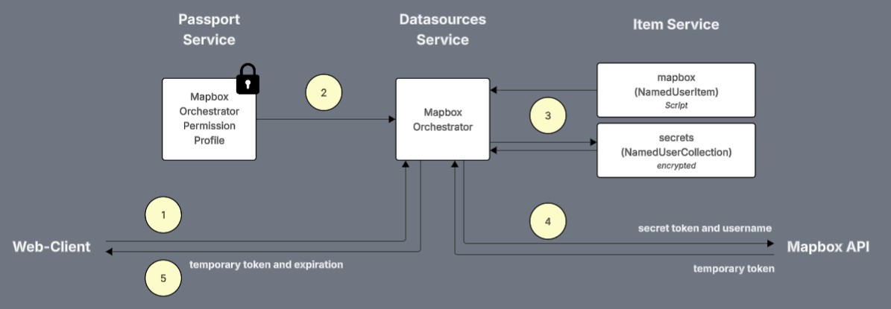

# Mapbox and Secrets

## Overview

The Mapbox token workflow is designed to fetch a temporary token from Mapbox to use in the web-client to enable 2D GS capabilities in the IafViewer. To retrieve a temporary token from the Mapbox API we need to use a secret token stored on Twinit. That secret token is stored in an encrypted NamedUserCollection to which only Admins and the Mapbox Token Orchestrator has access.

The workflow steps are:



1. The web-client runs the instant Mapbox Token Orchestrator
2. The Mapbox Token Orchestrator uses an assigned Permission Profile allowing it access to secrets collection
3. The Mapbox Token Orchestrator script fetches the secret token from the secrets collection
4. The Mapbox Token Orchestrator script then makes a request to the Mapbox API for a temporary token
5. The Mapbox Token Orchestrator returns the temporary token along with its expiration time to the web-client

This process ensures that Viewers, or any other future user group, cannot access the secret token in the encrypted NamedUserCollection, but that they can run the Mapbox Token Orchestrator to create temporary tokens for their use in the web-client.

To learn more about Mapbox temporary tokens see the [Mapbox documentation](https://docs.mapbox.com/api/accounts/tokens/#create-a-temporary-token).

## Secrets

You can use encrypted NamedUserCollections to store secrets for your application. Types of secrets you may wish to store can include:

* API key for accessing other external APIs
* Service Account Credentials for other systems
* Encryption keys

Using an encrypted NamedUserCollection, you can manage your secrets just as you manage any other item data in the Item Service, with the added capability of encrypting item fields that you designate.

In an encrypted NamedUserCollection, an field at the root of the item which begins with a dot will have its value encrypted in the Item Service.

### Creating the Encrypted Secrets NamedUserCollection

The [ProjectMaker script](../../../../setup/scripts/Project%20Maker.mjs#L9) creates a secrets collection. Passing ```_encryptionEnabled: true``` when creating a NamedUserCollection will turn on encryption for all items in the collection.

```js
// create or recrate a secrets encrypted collection to store sensitive data
let secretsCollection = await IafScriptEngine.createOrRecreateCollection({
      _name: `Secrets Collection`,
      _shortName: "secrets_coll",
      _description: "Named User Collection to store secrets data",
      _namespaces: project._namespaces,
      _userType: "secrets",
      _encryptionEnabled: true
   }
)
```

Only Admins are given access to the Secrets collection. Other user groups do not have access to the collection or the items within.

### Creating Encrypted Secret Items

The client [MapboxSettingsView pageComponent](../../../../app/ipaCore/pageComponents/mapboxSettings/MapboxSettingsView.jsx#L129) is then able to create an item including an unencrypted user name and an encrypted secret token.

```js
let newSecret = {
   type: 'mapbox-secret',
   ".secret": secret,
   username
}

// create new secrets item
IafItemSvc.createRelatedItems(secretsColl._userItemId, [newSecret]).catch((error) => {
   console.error('ERROR: Creating New Mapbox Secret Item')
   console.error(error)
}).finally(() => {
   checkReadiness()
})
```

A ```type: 'mapbox-secret'``` is included on the item as well, so the secrets collection may contain different types of secrets which can be queried based on their type. Currently the 'mapbox-secret' item is the only one used in the Quick Model View template.

## The Mapbox Token Orchestrator

The Mapbox Token Orchestrator is an instant orchestrator, meaning that the web-client can await a result from the orchestrator.

In order for the Orchestrator to run, it must have been assigned a permission profile allowing it access to:

* the orchestrator's workspace
* the secrets collection
* the mapbox script

This permission profile will allow users without permissions to the secrets collection to be able to run an orchestrator that does have permission to the secrets collection.

The permission profile is created in [ProjectMaker script](../../../../setup/scripts/Project%20Maker.mjs#L40).

```js
// create the permission profile for the Mapbox authorization instant orchestrator
// so that it can access the secrets collection
await IafPassSvc.createPermissionProfiles(
   [
      {
         _name: "Secrets orchestrator perms",
         _userType: "secrets_perm",
         _namespaces: [project._namespaces[0]],
         _permissions: [
            {
               _actions: ["READ", "SHARE"],
               _namespace: project._namespaces[0],
               _resourceDesc: {
                  _irn: `passportsvc:workspace:${project._id}`,
               },
            },
            {
               _actions: ["READ"],
               _namespace: project._namespaces[0],
               _resourceDesc: {
                  _irn: secretsCollection._irn,
               }
            },
            {
               _actions: ["READ"],
               _namespace: project._namespaces[0],
               _resourceDesc: {
                  _irn: newMapboxScript._irn,
               }
            }
         ]
      }
   ]
)
```

The orchestrator is then created using the permission profile.

```js
// create the Mapbox authorization instant orchestrator
// assigning the permission profile from above to it
const mapboxOrchResp = await IafDataSource.createOrchestrator({
   _name: "Request MapBox Token",
   _description: "Requests a MapBox token for a user",
   _namespaces: project._namespaces,
   _userType: "mapbox_temp_token",
   _schemaversion: "2.0",
   _instant: true,
   _permissionprofileid: permProfile._id,
   _params: {
      tasks: [
         {
            name: "default_script_target",
            _actualparams: {
               userType: "mapbox",
               _scriptName: "fetchMapboxToken"
            },
            _sequenceno: 1,
         }
      ]
   }
})
```

The web-client can then run the orchestrator as in [mapboxUtils.js](../../../../app/ipaCore/pageComponents/utils/mapboxUtils.js#L20):

```js
// fetches a new temporary access token for the IafViewer
async function _fetchTemporaryMapBoxToken() {

   let token = null

   // get the orchstrator for creating temporary mapbox tokens
   let res = await IafDataSource.getOrchestrators({_userType: 'mapbox_temp_token'})
   let tokenOrch = res._list.find(orch => orch._userType === 'mapbox_temp_token')

   if (tokenOrch) {

      let orchResult = await IafDataSource.runOrchestrator(tokenOrch.id, {
         orchestratorId: tokenOrch.id
      })
      
      if (orchResult._result.success) {
         token =  orchResult._result.token

         _saveTokenToSession(orchResult._result)
      } else {
         console.error("ERROR: running mapbox orchestrator")
         console.error(error)
      }
      
   }

   return token
}
```

## The Mapbox Script

The mapbox script which the Mapbox Token Orchestrator uses does the following:

1. Gets the secrets collection

```js
let secretsCollectionResp = await IafItemSvc.getNamedUserItems({query:{ _userType: 'secrets'}}, ctx)

if (secretsCollectionResp._total < 1) {
   result.success = false
   result.message = 'ERROR: Secrets collection not found!'
}

let secretCollection = secretsCollectionResp._list[0]
if (secretsCollectionResp._total > 1) {
   result.warning = 'WARNING: Multiple Secrets collections found - using first returned'
}
```

2. Gets the secret item with the type of 'mapbox-secret'

```js
let secretResp = await IafItemSvc.getRelatedItems(secretCollection._userItemId, {query: {type: 'mapbox-secret'}}, ctx)

if (secretResp._total < 1) {
   result.success = false
   result.message = 'ERROR: Mapbox secret key not found!'
}

let secretKey = secretResp._list[0]
if (secretResp._total > 1) {
   result.warning = 'WARNING: Multiple mapbox secret keys found - using first returned'
}
```

3. Creates an expiration for the temporary token it will request of on hour in the future (the Mapbox limit for temporary tokens)

```js
// create an ISO date tring for the token expiration = 1 hour
let expires = new Date(new Date().getTime() + TOKEN_EXPIRY * 1000).toISOString()
```

4. Constructs the Mapbox API url

```js
// add the user name to the Mapbox token url
// and encode the url
let tokenUrl = encodeURI(`${TOKEN_BASE_URL}${secretKey.username}`)
```

5. Then calls the Mapbox API to get a temporary token

```js
let tempRequest = await fetch(tokenUrl, {
   method: 'POST',
   headers: {
      Authorization: `Bearer ${secretKey['.secret']}`, // uss secret key fetched from Secrets collection
      'Content-Type': 'application/json'
   },
   body: JSON.stringify({
      expires,						// temp token expiration
      scopes: TOKEN_SCOPES		// temp token Mapbox scopes
   })
})
```

To learn more about Mapbox temporary tokens and the TOKEN_SCOPES see the [Mapbox documentation](https://docs.mapbox.com/api/accounts/tokens/#create-a-temporary-token).

## Permissions

To keep the secrets secure but also allow users without access to the secrets to generate tokens permissions have been distributed between user groups and permission profiles.

| Who/What | Permissions | Notes |
| --- | --- | --- |
| Admin user group | All Access | Admins can access the secrets collection and secret items as well as run the Mapbox Token Orchestrator |
| Viewer user group | READ and RUN the Mapbox Orchestrator | Viewers only have access to run the Mapbox Token Orchestrator |
| Mapbox Token Orchestrator | READ workspaces, READ mapbox script, READ secrets collection | The Mapbox Token Orchestrator has access only to what it needs to request temporary tokens from the Mapbox API|

---
[In-Depth: Template Data Model](../imp-data-model.md) < Back