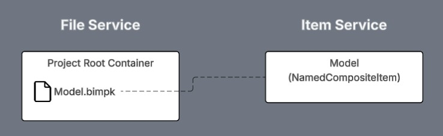
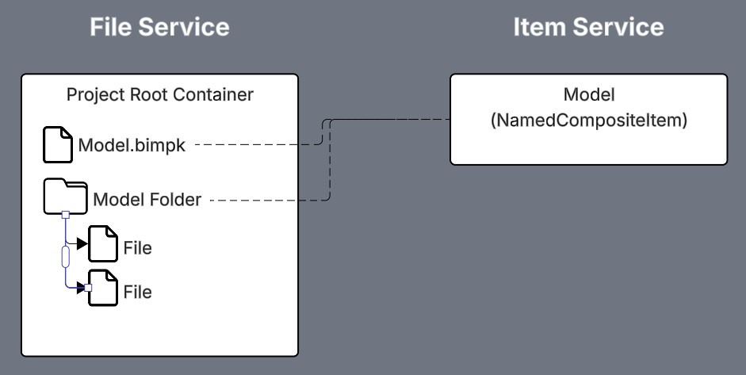
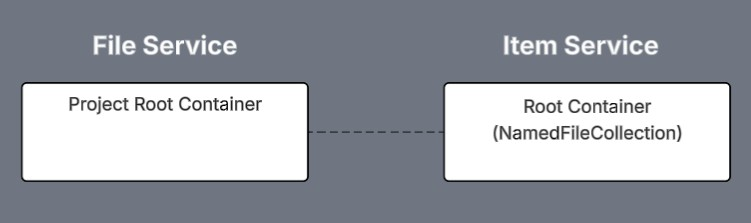
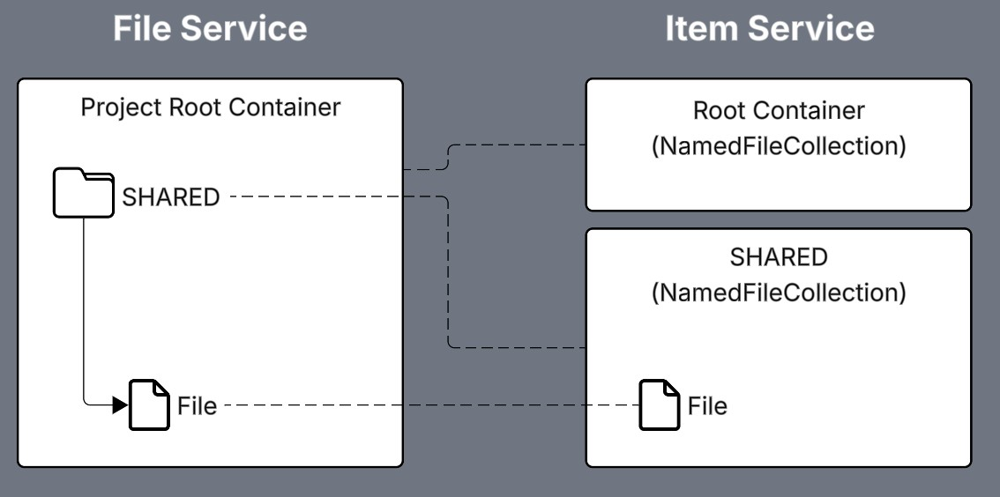
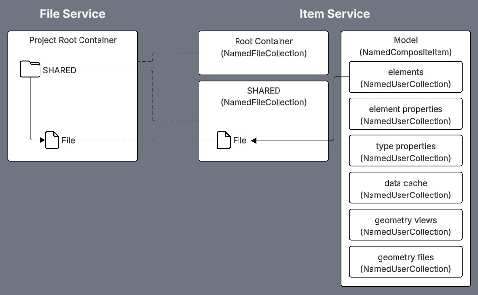

# Model Files

Files uploaded to Quick Model View are managed differently if associated to a model or a model element.

When uploading a file and associating it to model, the file is uploaded using the IafFileSvc PlatformApi to [Model Folders](#model-folders).

When uploading a file and associating it to a model element, the file is uploaded using the IafFile PlatformApi to [Model Element Folders and Items](#model-element-folders-and-items).

## Model .bimpks



All model .bimpk files are uploaded to the Root Container for the project in the File Service.

```
Root Container
├─ Model A.bimpk
├─ Model B.bimpk
```

Model .bimpk files can be retrieved from the File Service like this:

```js
const bimpkCriteria = {
   _namespaces: project._namespaces,
   _parents: 'root',
   _name: '.*bimpk',
}
   
//get all bimpk files in the current project
const fetchedBimpks = await IafFileSvc.getFiles(bimpkCriteria, null, { _pageSize: 100 })
```

## Model Folders



When a file is uploaded through the Quick Model View web-client, if a folder for the model does not yet exist in the Root Container, then one will be created with the model's name, and the file then uploaded to it.

Folders in the File Service can be added by:

```js
let modelFolder = await IafFileSvc.addFolder(modelComposite._name, project._namespaces)
```

Once files have been uploaded the File Service structure will look like this:

```
Root Container
├─ Model A.bimpk
├─ Model B.bimpk
├─ Model A
│  ├─ Model A file 1
│  ├─ Model A file 2
├─ Model B
│  ├─ Model B file 3
│  ├─ Model B file 4
```

A folder for a specific model can be fetched from the File Service like this:

```js
// gets or creates a File Service folder in the root container
// with the provided model's name
export const getModelFolder = async(project, modelComposite) => {

   let modelFolder

   let modelFolderResp = await IafFileSvc.getFiles({_name: modelComposite._name, _type: 'dir'})

   if (modelFolderResp?._total === 1) modelFolder = modelFolderResp._list[0]

   if (!modelFolder) {
      modelFolder = await IafFileSvc.addFolder(modelComposite._name, project._namespaces)
   }

   return modelFolder

}
```

And the files in that folder can be fetched like so:

```js
let allFiles = []
let total = 0
let _offset = 0
let _pageSize = 100

do {

   let filePage = await IafFileSvc.getFiles({_parents: modelFolder._id}, null, {_pageSize, _offset}, true)
   total = filePage._total
   _offset += _pageSize
   allFiles.push(...filePage._list)

} while (allFiles.length < total)
```

## Model Element Folders and Items

In order to associate files to a model element, we need to also create an item for it in the Item Service to relate to the model element item. We do this by mirroring the Fil Service folders in the Item Service using a type of NamedUserItem called a NamedFileCollection that contain items that represent a file in the File Service.

### Root Containers

As we saw above, the File Service contains a root container for all files in a workspace. It was in the File Service Root Container that we create the Model folder.

During file upload, the web-client will also create a NamedFileCollection named Root Container to mirror the File Service's Root Container.



You can get the create an Item Service NamedFileCollection Root Container by using:

```js
await IafFile.createContainer(
   { _namespaces: project._namespaces },
   undefined
)
```

You can get the Item Service NamedFileCollection Root Container by using:

```js
await IafFile.getRootContainer(project)
```

```json
{
  "_uri": "/nameduseritems/687e4b0e79f20cdac7152",
  "_name": "Root Container",
  "_userType": "file_container",
  "_tipId": "687e4b0e79f20f2dcd153",
  "_versions": [
    {
      "_userAttributes": {
        "path": "/"
      },
      "_userItemDbId": "687e4b0e79f20f2dc7152",
      "_id": "687e4b0e79f20f2dac7153",
      "_isTip": true,
      "_metadata": {
        "_updatedById": "d1408826-9647-494e-9669-4b1264e2",
        "_createdAt": 1753107214596,
        "_createdById": "d1408826-9647-494e-9669-4b121364e2",
        "_updatedAt": 1753107214596
      },
      "_version": 1
    }
  ],
  "_irn": "itemsvc:nameduseritem:687e4b0e79f20dac7152",
  "_namespaces": [
    "DemoM_UzQKuot"
  ],
  "_nextVersion": 2,
  "_shortName": "Root Container",
  "_tipVersion": 1,
  "_versionsCount": 1,
  "_itemClass": "NamedFileCollection",
  "_userItemId": "root container_s7r9NQNYEL",
  "_id": "687e4b0e79f20f2dcda52",
  "_description": "Root Container",
  "_metadata": {
    "_updatedById": "d1408826-9647-494e-9669-4b64e2",
    "_createdAt": 1753107214586,
    "_createdById": "d1408826-9647-494e-9669-43dc64e2",
    "_updatedAt": 1753107214586
  },
  "_kind": "collection"
}
```


### SHARED Folder

Within both the File Service and Item Service Root Containers, the web-client will also create a SHARED folder if it does not already exist. I is in hi folder that all files associated to model elements will be uploaded (File Service) and in which File Items will be created (Item Service).



You can create a new NamedFileCollection by using:

```js
await IafFile.createContainer(rootContainer, {
   _name: "Container Name",
   _description: "File Container for folder in file service",
   folderId: FileServiceFolder._id
})
```

You can retrieve the SHARED folder by using:

```js
await IafFile.getContainers(project, { _name: "SHARED" })
```

```json
{
  "_uri": "/nameduseritems/687e4b0f0648530816a",
  "_name": "SHARED",
  "_userType": "file_container",
  "_tipId": "687e4b0f0648533f5816b",
  "_versions": [
    {
      "_userAttributes": {
        "path": "/SHARED/",
        "parentPath": "/",
        "folderId": "b66bffe0-63b4-4112-9ba1-8fff3a62"
      },
      "_userItemDbId": "687e4b0f064885816a",
      "_id": "687e4b0f064853085816b",
      "_isTip": true,
      "_metadata": {
        "_updatedById": "d1408826-9647-494e-9669-4b12c64e2",
        "_createdAt": 1753107215437,
        "_createdById": "d1408826-9647-494e-9669-4b14e2",
        "_updatedAt": 1753107215437
      },
      "_version": 1
    }
  ],
  "_irn": "itemsvc:nameduseritem:687e4b0f0648533085816a",
  "_namespaces": [
    "DemoM_Uzuot"
  ],
  "_nextVersion": 2,
  "_shortName": "SHARED",
  "_tipVersion": 1,
  "_versionsCount": 1,
  "_itemClass": "NamedFileCollection",
  "_userItemId": "shared_xdIoKlxJv0",
  "_id": "687e4b0f064853816a",
  "_description": "File Container for SHARED folder in file service",
  "_metadata": {
    "_updatedById": "d1408826-9647-494e-9669-4b12132",
    "_createdAt": 1753107215434,
    "_createdById": "d1408826-9647-494e-9669-4b14e2",
    "_updatedAt": 1753107215434
  },
  "_kind": "collection"
}
```

### File Items

File Items are then created in the SHARED NamedFileCollection when uploading a file. The File Item includes a reference to the File in the File Service it represents.

You can upload files to the SHARED container using:

```js
await IafFile.uploadFileResumable(sharedContainer, file, {
   onProgress: (bytesUploaded, bytesTotal) => onUploadProgress(bytesUploaded, bytesTotal, file),
   onComplete: (upfile) => onUploadComplete(deferredResolve, upfile), // onComplete will be passed the file record in the file service
   onError: (error) => onUploadError(deferredReject, error, file)
});
```

The above will upload the file to the SHARED folder in the File Service, then create a file item in the SHARED NamedFileCollection in the Item Service. You query File Items as you would any other item in the Item Service.

Below is an example File Item.

```json
{
   "fileAttributes": {},
   "versions": [
      {
         "metadata": {
            "_updatedById": "da630aa1-f9da-481b-b27e-b1a7ec70",
            "_createdAt": 1753990865586,
            "_createdById": "da630aa1-f9da-481b-b27e-b1a7ec70",
            "_updatedAt": 1753990865586
         },
         "fileSize": 699693,
         "versionNumber": 1,
         "_fileVersionId": "43191d5e-19f5-4977-aebc-73c13af"
      }
   ],
   "name": "myuploadedfile.png",
   "tipVersionNumber": 1,
   "_id": "688bc6d42bc93f098cf8c",
   "containerPath": "/SHARED/",
   "nextVersionNumber": 2,
   "_metadata": {
      "_updatedById": "da630aa1-f9da-481b-b27e-b104dea7ec70",
      "_createdAt": 1753990868714,
      "_createdById": "da630aa1-f9da-481b-b27e-b104dea7ec70",
      "_updatedAt": 1753990868714
   },
   "_fileId": "c9486be6-1239-460d-80a1-d7a5b5fe"
}
```

The File Item contains these references you can use to get the file it represents in the File Service:

* _fileId: The id of the file in the File Service
* _versions[x]._fileVersionId: The id of the file version in he File Service
* _versions[x].versionNumber: The version number of the file version in the File Service

### Model Elements



Model elements are then related to the File Items in the Shared folder and can be queried in Twinit along with their related elements.

```js
let query = {
  parent: {
    query: elementQuery || {},
    collectionDesc: {
        _userItemId: collections.elements._userItemId,
        _userType: collections.elements._userType,
        "_versions.all": true,
        "_versions._version": collections.elements._userItemVersion
    },
    options: {
        page: { getAllItems: true }
    }
  },
  related: [
    {
      relatedDesc: {
        _relatedUserType: "file_container"
      },
      as: "RelatedFiles"
    }
  ]
}
```


---
[In-Depth: Template Data Model](../imp-data-model.md) < Back