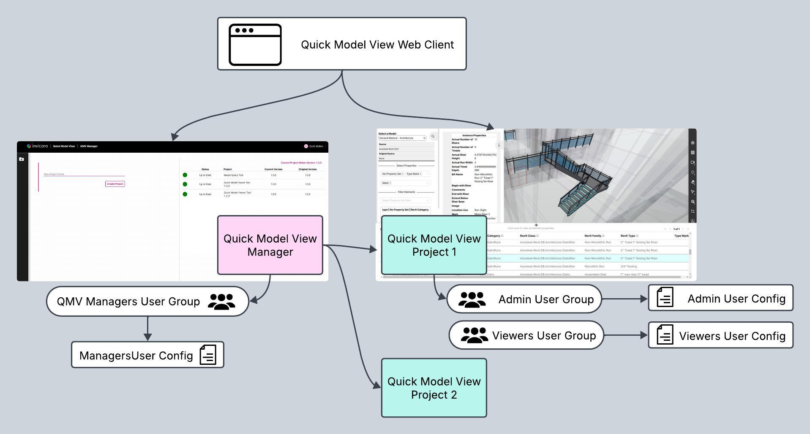

[Developer Guide](../README.md) < Back | **Start a Deploy** > [Gather Necessary Info and Check Twinit Access](../deploy/d1-gather.md)

---

# General Introduction: Quick Model View Twinit Application Template

## Purpose of the Template

This template serves many different purposes, and an understanding of what those purposes are will help you understand why the template is designed and delivered the way that it is.

### An Out-Of-The-Box Usable Application

One purpose the template serves is to be an out-of-the-box usable application supporting one or more use cases. If you follow the steps to deploy the template to Twinit and to build and deploy the template's web client, then you will have a fully functioning application. It will not be a fully featured application, we leave it to you to flesh out the application features with further development based on your use cases and needs.

### An Educational Tool

The template also serves as an educational tool about how templates work on Twinit, how to build web clients for Twinit applications, and even how to build your own templates. As such, the code delivered as part of the template is thoroughly (some may say excessively) commented and the template is accompanied by both a developer guide (describing the technical details of the template's implementation) and a user guide. The code is also written to be readable, which means in some cases some coding best practices may have been ignored in favor of delivering easier to read code. As you take the template code and modify for your needs, feel free to improve areas of the code where more efficient and cleaner choices could have been made.

## How the Template Works

The Quick Model View Application Template provides one web client that displays a different user interface depending on which type of Quick Model View project you are using.

* A Quick Model View Manager project
* Quick Model View projects

When using the Quick Model View Manager project, the user config related to the QMV Manager user group is used to display a user interface that allows the user to create new Quick Model View projects.

When using a Quick Model View project, created by the Quick Model View Manager, the user config related to either the Admin or Viewers user group is used to display a user interface allowing the user to view and interact with 2D/3D models.

### Quick Model View Manager Projects

When you deploy the Quick Model View template, what you first deploy is a special project on Twinit that contains the scripts, configs, and template files used to create Quick Model View projects. This special project is called a "Quick Model View Manager" project. You will then use the "Quick Model View Manager" and the templates included in it to create Quick Model View projects for your users where they can upload and view models.

The "Quick Model View Manager" project contains:

* A ["QuickViewManagerConfig" User Config](../../../setup/configs/ProjectMakerConfig.json) with the configuration for how the template web client should display the Project Maker user interface and what scripts should be used to create new Quick Model View projects
* A ["Project Maker" web client script](../../../setup/scripts/Project%20Maker.mjs), that contains all the logic for creating and configuring new Quick Model View projects
* Template model import scripts and user configs that will be used in newly created Quick Model View projects

### Quick Model View Projects

Quick Model View projects are created by the "Quick Model View Manager" and are configured to allow users to upload and view models.

Two user groups are created in each Quick Model View project:

* Admin
* Viewers

Admin users can upload and import models, as well as view the models. They have admin permissions to the entire project.

Viewers users can only view models and only have read-only access to the project.

The Quick Model View projects contain:

* A [user config for the Admin group](../../../setup/configs/QuickViewAdminConfigTemplate.json) for the template web client UI
    * Configured to display the Model Import, Model View, and User Groups pages
* A [user config for the Viewers group](../../../setup/configs/QuickViewViewerConfigTemplate.json) for the template web client UI
    * Configured to display the Model View page
* An ["importHelper" script](../../../setup/scripts/importHelperTemplate.mjs) with the logic used to import model bimpks to Twinit
* A Datasources orchestrator configured to use the "importHelper" script to import model bimpks uploaded to the Twinit File Service

### The Quick Model View Template Workflow

A typical workflow for using the Quick Model View Twinit Application Template would be:

1. Sign in to the Quick Model View application and the "Quick Model View Manager"
2. Create a new project using the "Quick Model View Manager" user interface
3. Switch to the newly created Quick Model View project
4. Upload and import a model using the model import page or one of the supported CAD Twinit plugins
5. View the model in the Twinit 2D/3D model viewer
6. Invite other users to Quick Model View project to view the model

## Finding Support

As you work through the deployment of the template or the template's web client, you may encounter issues or have questions about what you are doing.

Be sure to visit the [digitaltwin-factory community](https://community.digitaltwin-factory.com/) to find help.

You'll find easy reference links to [Twinit Academy](https://community.digitaltwin-factory.com/cohorts-npcs64ni) if you ned to quickly refresh your memory on topics covered in the training.

The [Knowledgebase](https://community.digitaltwin-factory.com/knowledgebase-5wzpkylt) is a growing library of common issues and their solutions to help keep you working.

And a community of developers are waiting to answer your questions in the [Ask the Community forum](https://community.digitaltwin-factory.com/ask-the-community).

---
[Developer Guide](../README.md) < Back | **Start a Deploy** > [Gather Necessary Info and Check Twinit Access](../deploy/d1-gather.md)