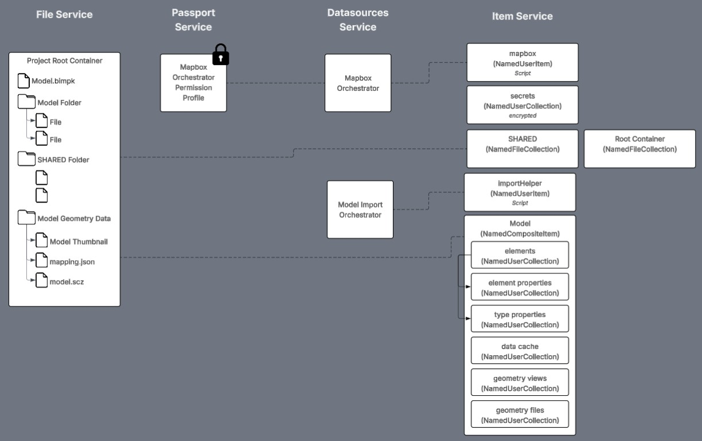

# In-Depth: Template Data Model

The Quick Model View Application Template manages these types of data:

* [Imported Model Data](./data/imported-model.md) - learn about the imported model data is stored and versioned in the item service and common ways of querying it
* [Mapbox & Secrets](./data/mapbox-secrets.md) - learn how secrets can be stored in encrypted NamedUserCollections and how the Mapbox token workflow uses a secret to request temporary Mapbox tokens
* [Model Files](./data/model-files.md) - learn how files are managed in the file for models

Future updates to the template may introduce new types of data to the list.

---
[Developer Guide](../README.md) < Back | Next > [In-Depth: Template Permissions](./imp-perms.md)