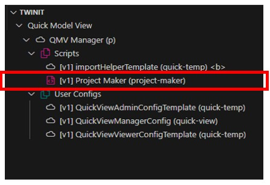
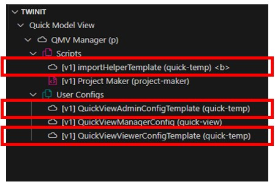

# In-Depth: Quick Model View Manager

The Quick Model View Manager project contains two types of items:

* Manager User Configs and Scripts needed for the Project Maker functionality and user interface
* Template Scripts and User Configs to deploy to the new Quick Model View projects the Manager creates and updates

## QMV Manager User Groups

The Quick Model View Manager project has only one User Group:

* QMV Managers

Adding uses to the QMV Managers user group will give them access to the QMV Manager project, but it will not permit them to also create new projects.

In order to use the QMV Manager, users must also be added to your application's Application Developer user group. This access is necessary to allow the user to create new projects and user groups. Refer to the "Getting Access as an Application Owner or Application Developer" step in the [Deployment Guide](../deploy/d1-gather.md) for more information.

## QMV Manager User Configs and Scripts

The QMV Manager project has one user config to provide the user interface and one script to provide the logic for creating and updating Quick Model View projects.

### QMV Manager User Config

The QMV Manager user config is named "QuickViewManagerConfig" and has the _userType "quick-view".


The User Config exposes two pages to the user:

* The User Groups page for managing users access to the QMV Manager project (via the header menu)
* The Project Maker page handler

### Project Maker Page Handler

The Project Maker pageComponent is configured to display in the web client by the following handler in the User Config.

```json
"projectMaker": {
   "title": "QMV Manager",
   "icon": "fas fa-folder-plus fa-2x",
   "shortName": "projmk",
   "description": "Create New Quick Model View Projects",
   "pageComponent": "projectMaker/projectMakerView",
   "path": "/projectmaker",
   "scriptTypes": [
      "project-maker"
   ],
   "config": {
      "currentVersionScript": "getCurrentMakerVersion",
      "projectCreateScript": "createNewQuickModelViewProject",
      "projectUpdateScript": "updateQuickModelViewProject"
   }
}
```

The Project Maker pageComponent relies on a script or scripts to create and update Quick Model View projects.

Those scripts are specified in the handler in two places.

1. **scriptTypes**: the _userType of the script in Twinit must be specified in the handlers scriptTypes array so that the necessary script item can be loaded when the page loads, making the scripts the page needs available o be run
2. **config**: three scripts must be configured in the handlers config to support creating and updating projects:
   * **currentVersionScript**: returns the current version assigned to newly created Quick Model View projects. This is also used to determine if existing projects are out of date
   * **projectCreateScript**: the script used to create new Quick Model View projects
   * **projectUpdateScript**: the script used to migrate a project from an older version to the current version

> **Why use a script for the creation and update code, instead of including the logic directly in the pageComponent?** While we could have included the code to create a new project or update an existing project directly in the pageComponent, we would have required a web client deployment in order to change the project creation or update process. By using a script, we can independently change the processes without needing a web client change. If, for instance, we wanted to create an additional user group during Quick Model View project creation, we could simply update the script, commit it to our Project Maker project on Twinit. The changes would immediately take effect. If the code was in the pageComponent, we'd need to deploy a new web client version to update the business logic of the application.

### Project Maker Script File

The Project Maker script file is named "Project Maker" and has the _userType "project-maker".



This script file contains the individual scripts configured in the page handler. In addition to the script descriptions below, read through the [commented script code](../../../setup/scripts/Project%20Maker.mjs) to understand how the script works.

#### getCurrentMakerVersion

The getCurrentMakerVersion script simply returns the current version of the Project Maker script. This version is applied to each new Quick Model View project it creates and is used to determine if existing projects are out of date.

#### createNewQuickModelViewProject

The createNewQuickModelViewProject script creates new Quick Model View projects. The script takes two inputs:

* projName: the name of the project to create. A project name is required.
* projDesc: the description of the new project. If no projDesc is provided the projName will be used as the projDesc. _The current Project Maker user interface does allow for setting the new project description_.

The script does the following:

1. Retrieves the template scripts and user configs that will be added to the new Quick Model View project, from the QMV Manager project. The scripts and user configs all have the _userType "quick-temp".



2. Creates the new project in Twinit
3. Switches its context to working within the newly created project
4. Create an Admin User Group with all permissions to the project
5. Creates an Admin user config from the QuickViewAdminConfigTemplate and relates the new config to the Admin User Group
6. Creates a Viewers User Group
7. Assigns read-only permissions to the project to the Viewers User Group
8. Creates a Viewers user config from the QuickViewViewerConfigTemplate and relates the new config to the Viewers User Group
9. Creates a new importHelper script from the importHelperTemplate script.
10. Creates an import orchestrator that uses the newly created importHelper script.
11. Switches its context back to working within the QMV Manager project

While the script is running it uses the callback function provided by the web client to provide success or error updates to the user interface like so:

```js
if (callback) callback(`Step 9: Related Viewer User Config to Viewer User Group`)
```

Detailed results of each step or errors are also logged to the browser console, to allow for further debugging if needed.

As new features are added to the Quick Model View Application Template, the project creation steps are likely to change and grow.

#### projectUpdateScript

The updateQuickModelViewProject script updates a Quick Model View project to the latest version by running one or more migrations on the project.

The script takes two inputs:

* project: REQUIRED: the project to update
* version: REQUIRED: the current version of the project

Currently, as of version 1.3.0, there are no migrations to perform, so the script contains only the basic framework for applying updates once any are available.

When one or more updates are available, the script will do the following:

1. Find the migration from the list of migrations where the "from" version matches the current version of the project
2. Execute the migrations migrateFunction and update the project to the "to" version on the migration
3. Continue 1 & 2 until no further migrations are found

While the script is running it uses the callback function provided by the web client to provide success or error updates to the user interface like so:

```js
if (callback) callback(`Step 3: Update Viewer User Config`)
```

Detailed results of each step or errors are also logged to the browser console, to allow for further debugging if needed.

## Template Scripts and User Configs

The template scripts and user configs are the templates for the scripts and user configs that will be created in new projects created using the QMV Manager. Templates all have the _userType "quick-temp".


If you wish to make changes to how Quick Model View projects are created, you'll do so by modifying or adding to these script and config templates.

### importHelperTemplate Script

The importHelperTemplate script is the template for the script used to import model bimpks into Twinit. It gets added to newly created Quick Model View projects and is used by the import orchestrator.

The script takes as inputs:
 * fileId: the _id of a bimpk in the File Service
 * filVersionId: the _id of a version of the file in the File Service

The script then imports the contents of the bimpk into Twinit. For more information on the model import process please refer to the "Twinit Self-Led Developer Training Intermediate" course on [Twinit Academy](https://academy.twinit.io/enrollments).

### QuickViewAdminConfigTemplate User Config

The QuickViewAdminConfigTemplate user config is added to new Quick Model View projects and related to the Admin user group.

To learn more about the QuickViewAdminConfig User Config read [In-Depth: Quick Model View Projects](./imp-qmvprojects.md).

### QuickViewViewerConfigTemplate User Config

The QuickViewViewerConfigTemplate user config is added to new Quick Model View projects and related to the Viewers user group.

To learn more about the QuickViewViewerConfig User Config read [In-Depth: Quick Model View Projects](./imp-qmvprojects.md).

---
[Developer Guide](../README.md) < Back | Next > [In-Depth: Quick Model View Projects](./imp-qmvprojects.md)