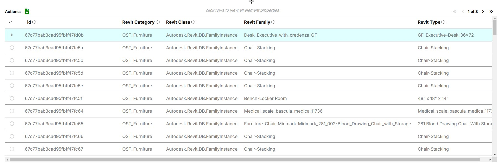

# User Config Theme Additions

Both user config templates for Admin and Viewers were updated to include tyling for the new element table.

## Additional Styles

```json
"styles": {

   // NEW styles for the element table in the bottom panel
   "--element-table-font-primary": "#141414",
   "--element-table-font-secondary": "#757575",
   "--element-table-font-disabled": "#9e9e9e",
   "--element-table-border": "#9e9e9e",
   "--element-table-selected-row-color": "lightcyan"
}
```



---
[Developer Update Guide](../README.md) < Back