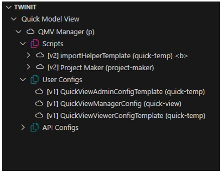
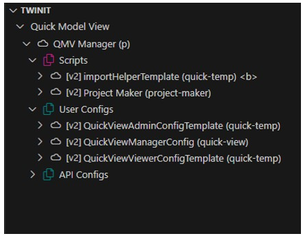
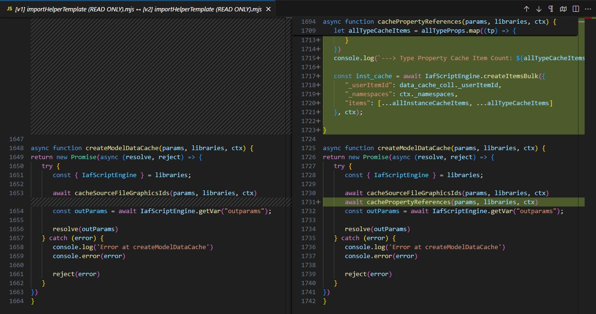

# Deploy Template Updates to Twinit

To update your deployed template on Twinit you will:

1. Update scripts in your Quick Model View Manager project
2. Update user configs to your Quick Model View Manager project

## Update Scripts

Using the Twinit VS Code extension:

1. Expand new "QMV Manager" project in the extension panel
2. Right click on the Scripts folder and select "Bulk Load Scripts"
3. When prompted for a Script Info file, navigate to the directory in which you have saved the template code, and select ```setup/scriptInfo.json```
4. When prompted to select script files, navigate to the directory in which you have saved the template code, and select all the ```.mjs``` files in ```setup/scripts```
5. Once the script upload has completed, the panel will refresh showing new versions of the scripts have been created



## Update User Configs

Using the Twinit VS Code extension:

1. Right click on the User Configs folder ad select "Bulk Load Configs"
2. When prompted for a Config Info file, navigate to the directory in which you have saved the template code, and select ```setup/configInfo.json```
3. When prompted to select config files, navigate to the directory in which you have saved the template code, and select all the ```.json``` files in ```setup/configs```
4. Once the config upload has completed, the panel will refresh showing new versions of the configs have been created



## Viewing Changes

You can view the differences between the latest and previous version of any script or user config by:

1. Right click on a script or user config
2. Click "Diff with Version..."
3. When prompted select the previous version of the script or user config

A diff document, like the one pictured below, will open highlighting the changes.



You can also learn more about the specific changes in the **Changes in 2.0.0** section of the [Developer Update Guide](./README.md)

---
[Developer Update Guide](./README.md) < Back | Next > [Deploy the Updated Web Client](./update/updateWebclient.md)