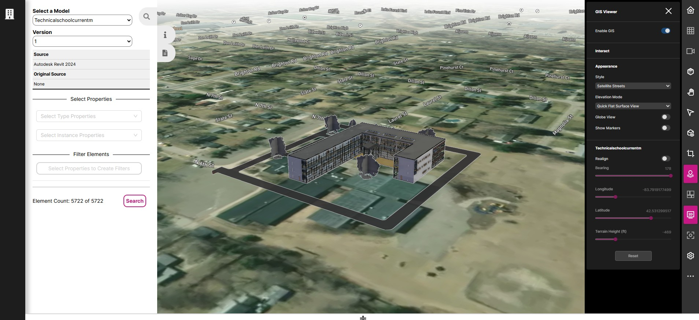
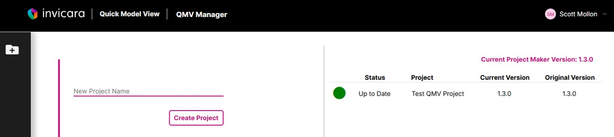

# User Guide: Quick Model View Twinit Application

**If you have made your own changes to Quick Model View from a previous release, be sure to read the [Migration User Guide](./migrationguide/migrate.md) to ensure you have access to all of the latest features.**

---

The **Quick Model View Application** gives you the ability to upload and import your models to Twinit and then view and interactively explore your models in 2D and 3D.

[Learn how to use the Quick Model View Application](./quickmodelview/README.md)

 

Using the **Quick Model View Manager** you can create new Quick Model View projects. This allows you to separate models and users for different designs or activities into their own workspaces. The **Quick Model View Manager** also allows you to update existing workspaces as new releases of the template become available.

[Learn how to use the Quick Model View Manager](./projectmaker/README.md)

---

[Home](../../README.md) < Back