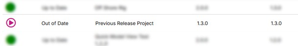
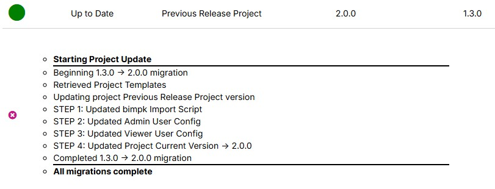
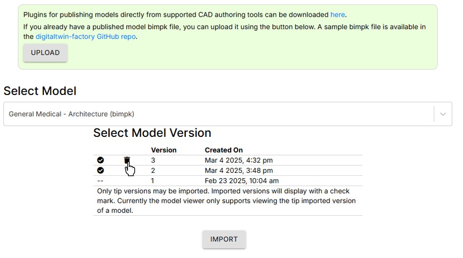
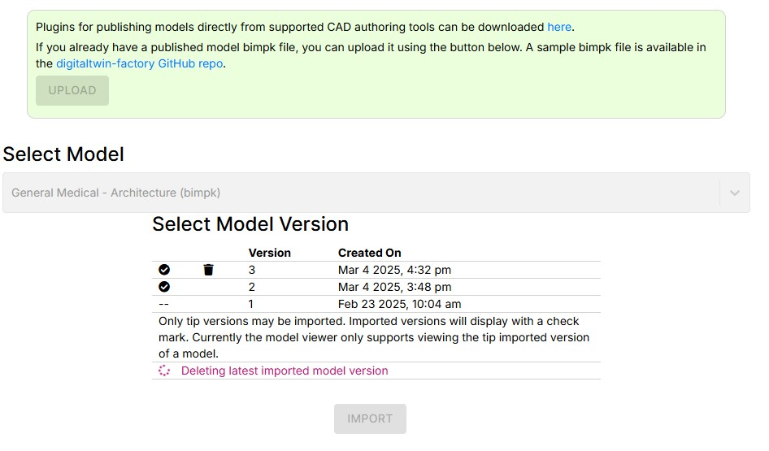
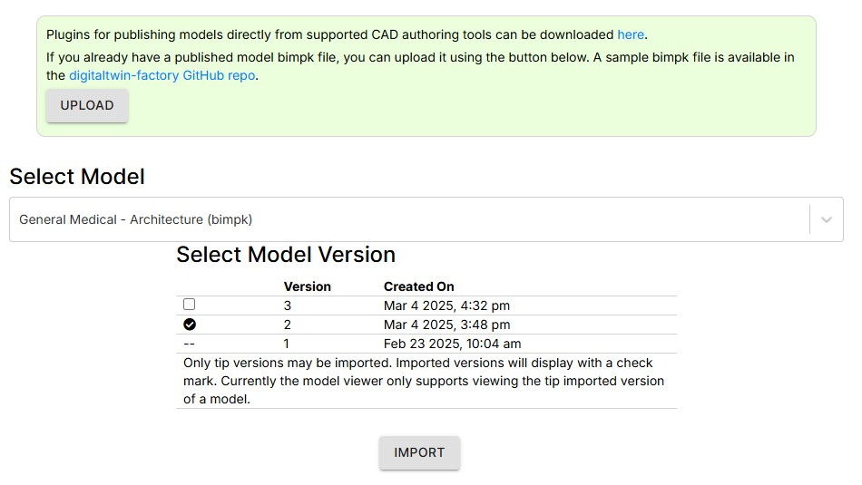
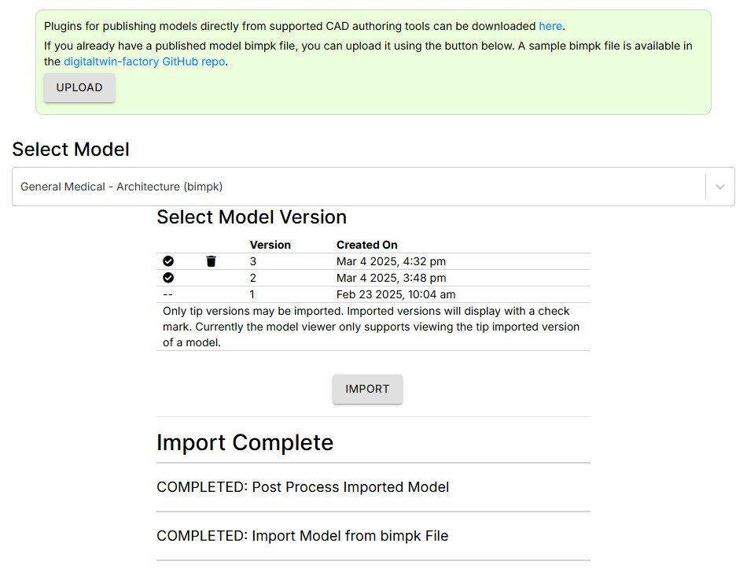

# Migration Guide

In order to take advantage of all the latest features in the 2.0.0 release, projects need to be migrated to the 2.0.0 release and models must be re-imported.

Migration of a project is not required. All project will continue to function at the previous level of functionality.

> **Note**: The migration process must be performed by each Quick Model View Manager on each of the projects they have created.

To migrate a project:

1. Follow the steps in [How to Migrate a Project](../projectmaker/migrateproject.md) to migrate the project to the new release.

2. Sign in to the migrated project, and follow the steps in [How to Delete the Latest Imported Model](../quickmodelview/deletemodel.md) to delete the latest imported version of each model.

3. Re-import the latest model bimpk version following the steps in [How to Import a Model](../quickmodelview/importmodel.md).

Once you have completed the previous steps your Quick Model View projects and model will be fully migrated and enabled for all new features.

---

[User Guide](../README.md) < Back