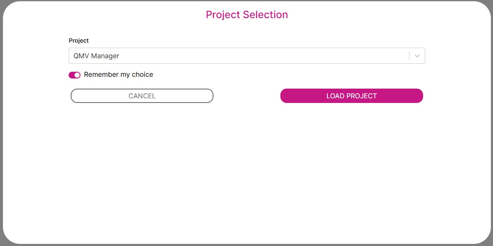
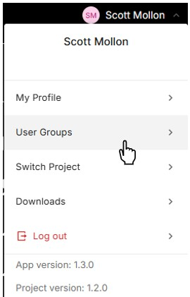
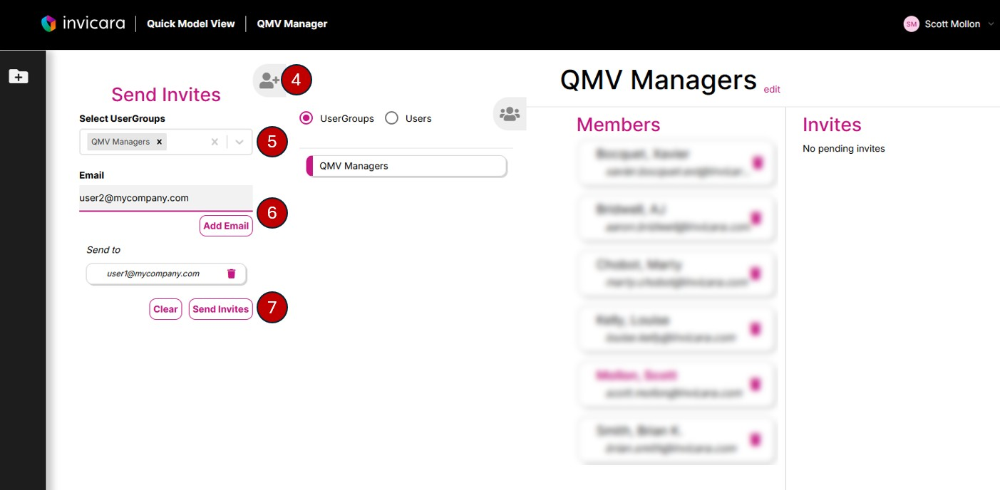

# How to Add New Quick Model View Manager Users

To give a user access to the Quick Model View Manager, you will add them to two user groups.

* The application's App Developer User Group
* The QMV Managers User Group

1. Send your Application Owner responsible for administrating the Quick Model View application the email address for the user you wish to add and ask they are added to the App Developer User Group. Information on how to add App Developers is available in the "Getting Access as an Application Owner or Application Developer" section of the [Developer Guide](../../developer%20guide/deploy/d1-gather.md).
2. Sign in to a Quick Model View Manager project

3. In the header menu select "User Groups"

4. On the User Groups page expand the "Send Invites" panel
5. Select the QMV Managers User Group in the "Select UserGroups" dropdown
6. Enter the email of the user you want to invite and click Add Email
8. Click Send Invites

The users will receive two emails with a links to accept the invitations to the App Developer group and the QMV Managers group.

---
[Quick Model View Manager User Guide](./README.md) < Back