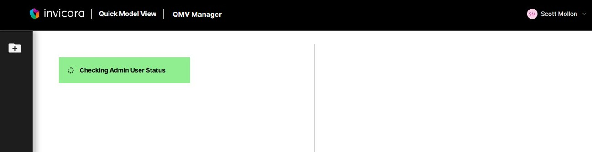
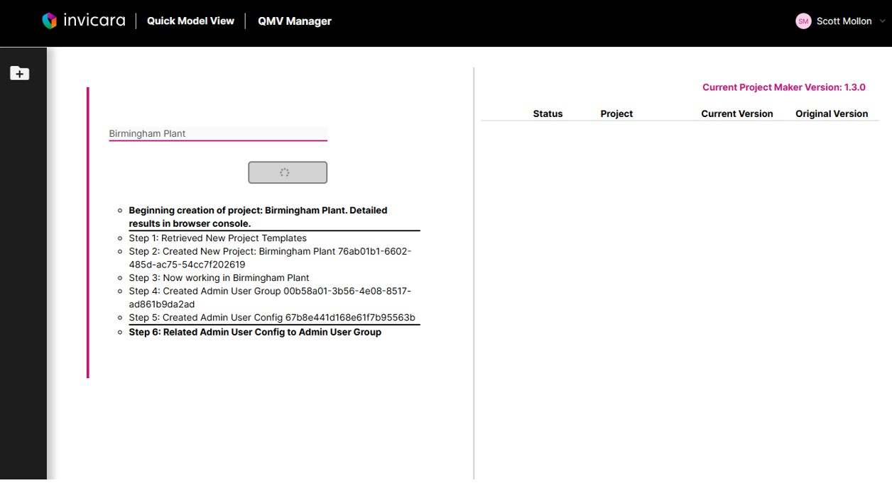
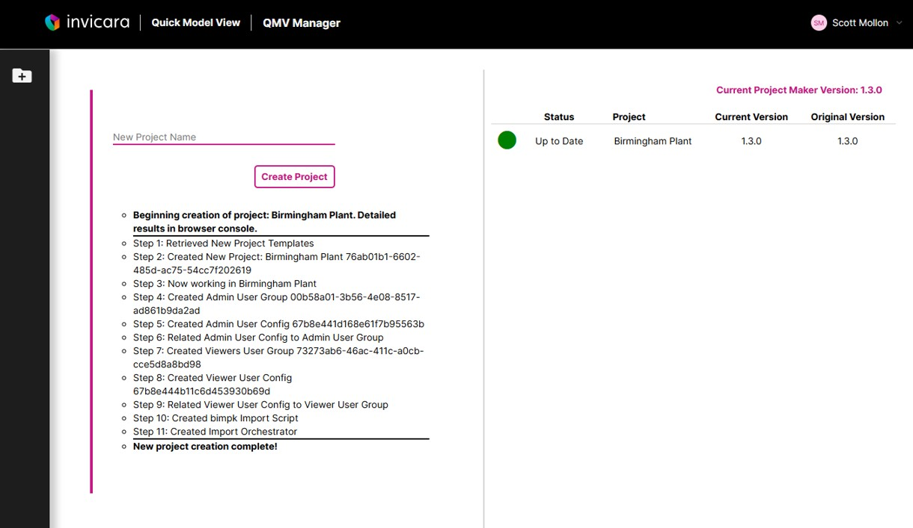

# How to Create a New Project

1. Sign in to a Project Make project

2. The page will check to make sure the user has the admin access necessary to create a new project

3. Type a new project name in the "New Project Name" text field
4. Click the "Create Project" button

A status log will display and update completed steps as the new project is created.

Once complete the new project will appear on the list to the right side of the page.

---
[Project Maker User Guide](./README.md) < Back