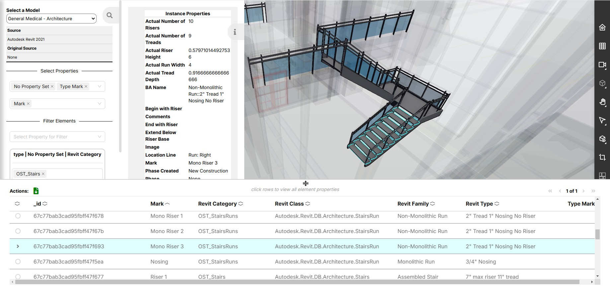

# Learn How to Use the Quick Model View Application

## Features

The Quick Model View Application provides capabilities to upload, import, and view model data on Twinit. Features include:

* **Access to download Twinit CAD authoring tool plugins**. Once the Twinit plugin is installed on your CAD authoring tool of choice, you can sign in to Twinit and upload a representation of your model. This is a representation of your model, not the actual file the CAD authoring tool saves and manages. The model representation is referred to as a "bimpk" file.
* **Importing of uploaded model representations**. The Quick Model View Application provides a Model Import page that allows the user to view the different model representations (bimpks) uploaded to the project and the different file version of those bimpks. The user can then select one at a time to be imported to the project.
* **Viewing the graphics for imported models**. The Quick Model View Application provides a Model View page that provides for viewing the imported models in the project. Both 2D and 3D views of the model are supported. All the viewer features are also supported such as cutting planes, and view modes.
* **Viewing model element properties**. Using the Model View page, model elements can be selected in the model 2D/3D viewer, and the properties on the element can be viewed.
* **Invite users to view models**. Using the Quick Model View Application User Groups page, users ca be invited to participate and view models.

## User Groups

Feature access is controlled by the User Group to which a user is a member. There are two user groups in Quick Model View projects:

* Admin
* Viewers

Users in the **Admin** user group have full permissions to all resources in the Quick Model View project.

Users in the **Viewers** group have read-only permissions to all resources in the Quick Model View project.

The features available to each user group are listed below:

| User Group | Download Plugins | Import Models | View Models | View Model Element Properties | Invite Users |
| --- | --- | --- | --- | --- | --- |
| **Admin** | Yes | Yes | Yes | Yes | Yes |
| **Viewers** | Yes | No | Yes | Yes | No |

## Tutorials

* [How to download Twinit CAD plugins](./downloadplugins.md)
* [How to upload a model](./upload.md)
* [How to import a model](./importmodel.md)
* [How to view a model and model element properties](./viewmodel.md)
* [How to invite users to a Quick Model View project](./inviteusers.md)

---

[User Guide](../README.md) < Back