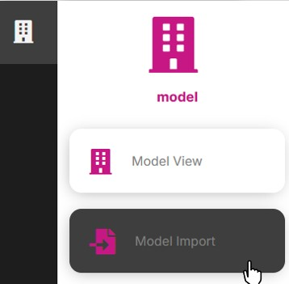
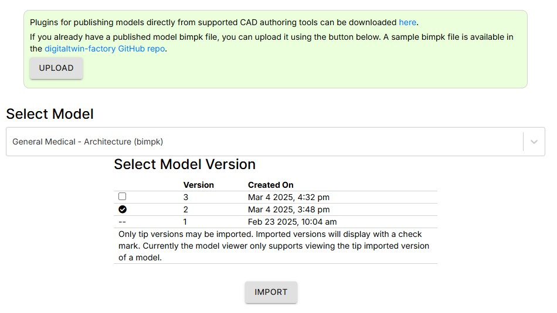

# How to Delete the Latest Imported Model

1. Select the Model Import page

2. Select a model in the Select Model dropdown
3. Click the trash can icon next to the latest imported model version

4. A message will display as the imported model is deleted

5. When the delete is finished the page will update to allow you to reimport the bimpk again

---
[Quick Model View User Guide](./README.md) < Back | Next > [How to View a Model and Model Element Properties](./viewmodel.md)