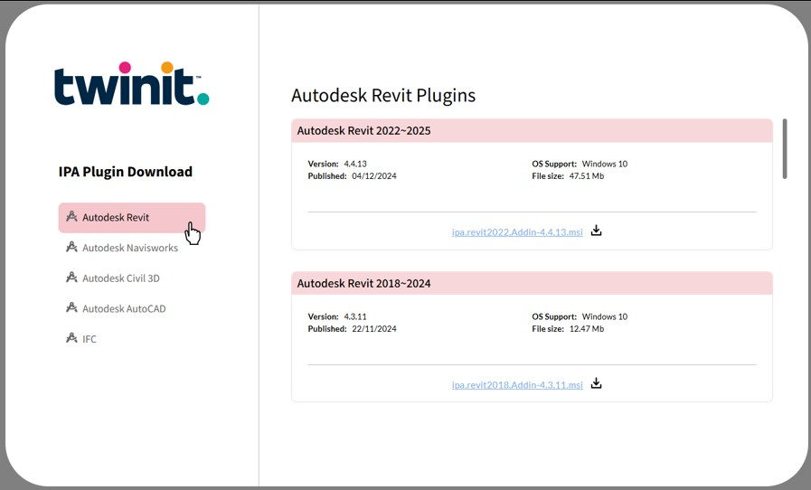

# How to Download Twinit CAD Plugins

1. In the header menu select "Downloads"

2. A new browser tab will open to the plugin download page
3. Select your CAD authoring tool

4. Click the link to download the latest version of the plugin

> **Note**: The Navisworks plugin is not supported with the Quick Model View Application.

**For instructions on installing and using the plugins to upload a model to your project please visit the documentation on [twinit.dev](https://twinit.dev/docs/concepts/plug-ins/ipa-plugins)**

---
[Quick Model View User Guide](./README.md) < Back | Next > [How to Upload a Model](./upload.md)