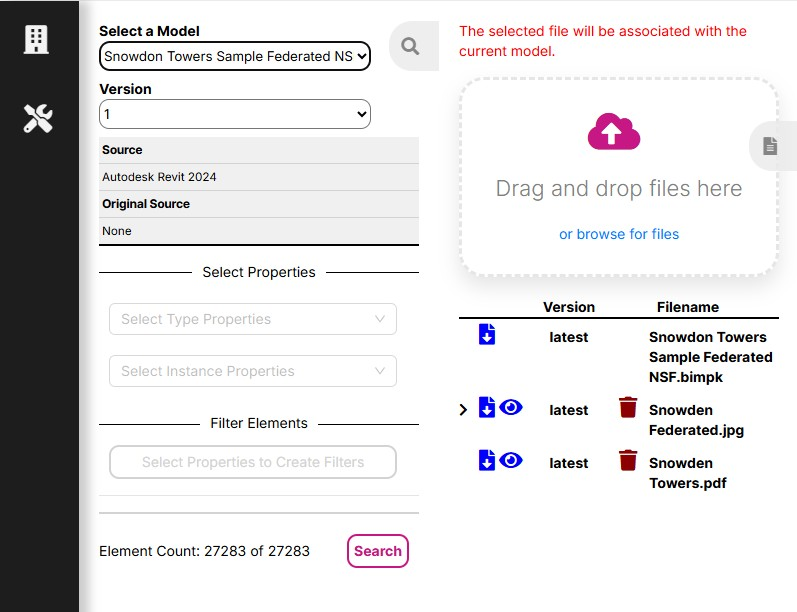
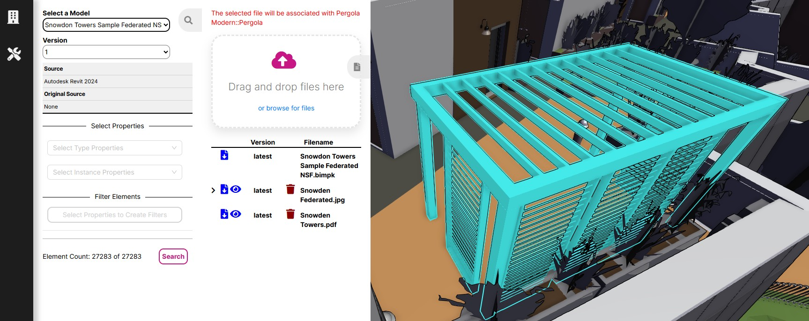
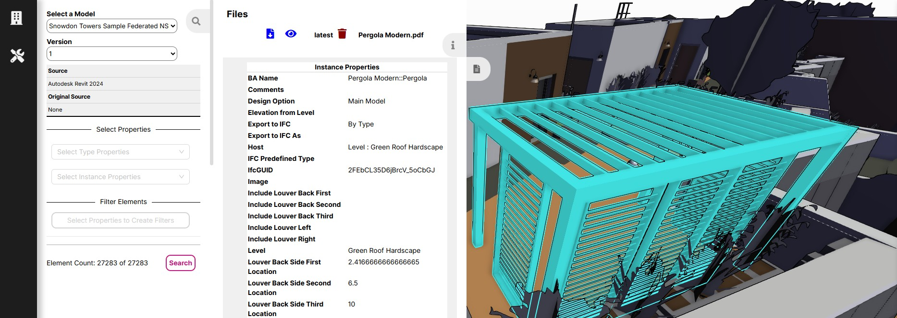
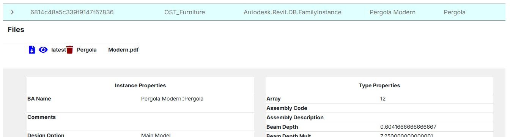
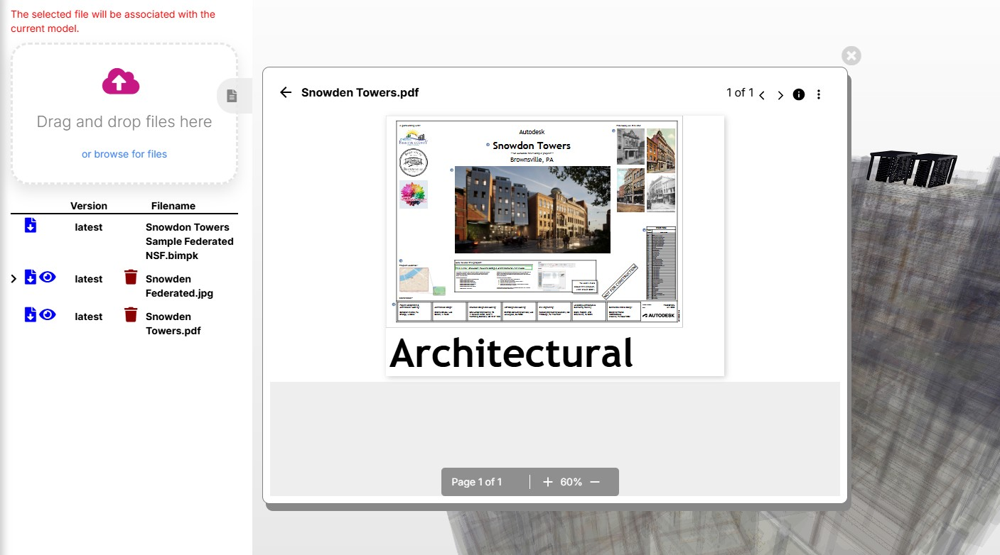

# How to Manage Files

Follow the link for tutorials on how to:

* [Upload and associate files to a model](#upload-and-associate-files-to-a-model)
* [Upload and associate files to a model element](#upload-and-associate-files-to-a-model-element)
* [View and download files](#view-and-download-files)
* [Delete files](#delete-files)

## Upload and Associate Files to a Model

Admins can upload and associate files to a model by:

1. Select the model in the Model View page
2. Expand the Files drawer

3. Drag and drop files on the drop zone or click the browse for files link and select files from a dialog

Files associated to a model will display in the file table below when upload is complete.

> Note: The model .bimpk file will always display in the model files for easy access.

## Upload and Associate Files to a Model Element

Admins can upload and associate files to a model by:

1. Select the model in the Model View page
2. Select a model element in the viewer
3. Expand the Files drawer

4. Drag and drop files on the drop zone or click the browse for files link and select files from a dialog

Files associated with a model element will display in the elements info drawer

and in the table row for the element.

## View and Download Files

All users can view and download files.

To download a file:

1. Click on the download icon for a file

To view a file in the browser:

1. Click on the eye icon for a file

A dialog will open displaying the contents of the file.

> Note: The icon to view a file will only display if the file is of a file type supported by the in browser viewer.

## Delete Files

Admins can delete files by:

1. Click on the trash bin icon for a file

> Note: Deleted files are permanently deleted and cannot be retrieved.