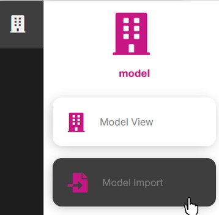
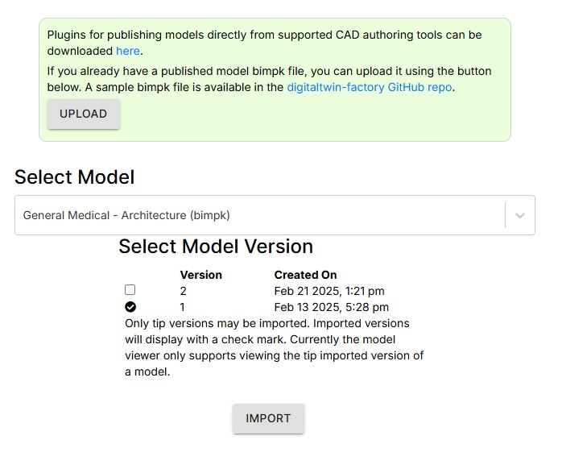
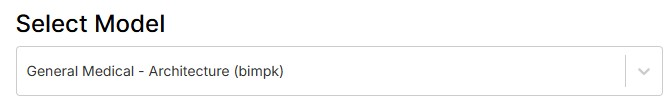
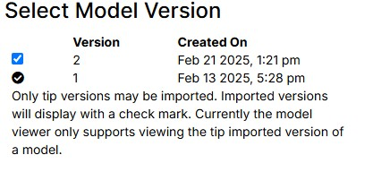
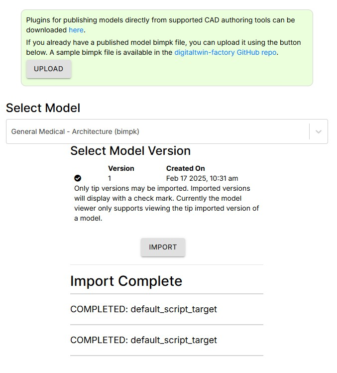

# How to Import a Model

1. Select the Model Import page

2. Select the name of the model you wish to import in the Select Model dropdown

3. Check the box of the version to import

4. Click the Import button

The import process will begin and the status of each import step will be displayed as thy move from QUEUED to RUNNING to COMPLETE.

Once the import is complete the model is ready for viewing.

---
[Quick Model View User Guide](./README.md) < Back | Next > [How to View a Model and Model Element Properties](./viewmodel.md)