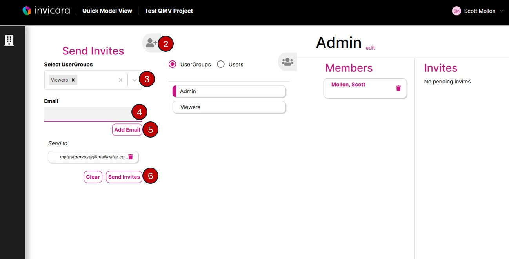

# How to Invite Users to a Quick Model View Project

1. In the header menu select "User Groups"

2. On the User Groups page expand the "Send Invites" panel
3. Select the Admin, Viewers, or both User Groups in the "Select UserGroups" dropdown
4. Enter the emails of the users you want to invite to the selected User Groups
5. Click Add Email
6. Click Send Invites

The users will receive an email with a link to accept the invitation the Quick Model View project.

---
[Quick Model View User Guide](./README.md) < Back