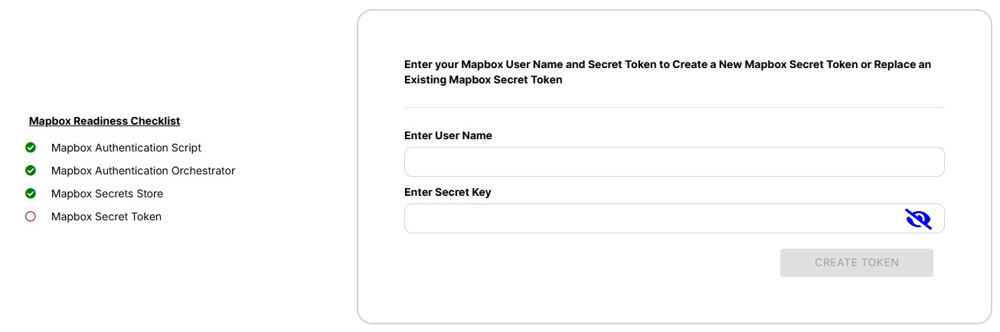

# How to configure Mapbox credentials

Admins can configure a Mapbox user name and secret key to enable 2D GIS using Mapbox in the model viewer.

## Getting a Mapbox Account

To use Mapbox in the model viewer you will need (t minimum) a free Mapbox account.

To create a Mapbox account visit:

[https://account.mapbox.com/auth/signup/?route-to=https%3A%2F%2Fconsole.mapbox.com%2F%3Fauth%3D1](https://account.mapbox.com/auth/signup/?route-to=https%3A%2F%2Fconsole.mapbox.com%2F%3Fauth%3D1)

Once you have an account follow the steps to create your secret token here:

[https://docs.mapbox.com/help/dive-deeper/access-tokens/](https://docs.mapbox.com/help/dive-deeper/access-tokens/)

## Configure Quick Model View

To configure Mapbox in your Quick Model View project:

1. Navigate to the Mapbox Settings page

2. You will see a checklist displaying the required configurations to enable Mapbox in your project. If any of the first three checks are missing your project was not successfully migrated to the latest release. The four checkbox should be unchecked.

3. Enter your Mapbox user name and secret token into the form and click Create Token

4. Once the token is successfully and securely saved to Twinit all four checkboxes should be checked.

You are now ready to use Mapbox in the model viewer.