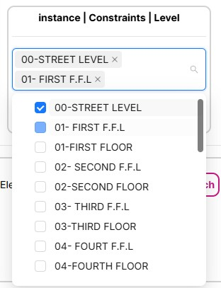
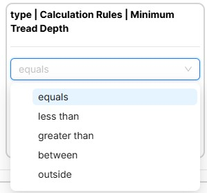
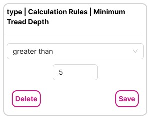
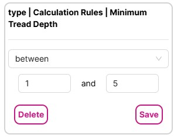

# Using Search Filters

## Search Structure

When adding multiple filters for multiple properties, only model elements that match all of the filters will be returned. The resulting query created by the filters will be an AND query.

If you configure three filters elements must match "filter 1' AND 'filter 2' AND 'filter 3'.

## Supported Property Types

Currently two types of properties are supporting in search filters:

* Text properties
* Number properties

You can select properties of other types to appear as columns in the element table, but they will not appear in the list of properties for which you can create filters.

### Filtering Using Text Properties

When a text property is chosen for a filter, it will allow you to select one or more of the text values that exist in the model for that property.

Selecting multiple values will return model elements with any of the property values.

### Filtering Using Number Properties

You can filter on number properties in five ways:

* equals
* less than
* greater than
* between
* outside

When configuring an 'equals', 'less than', or 'greater than' filter provide one number to use for the comparison.

When configuring a 'between' or 'outside' filter provide two numbers to use for the range comparison.

The order of the numbers does not matter. The filter will sense the larger of two numbers and construct the correct query.

---
[Quick Model View User Guide](./README.md) < Back