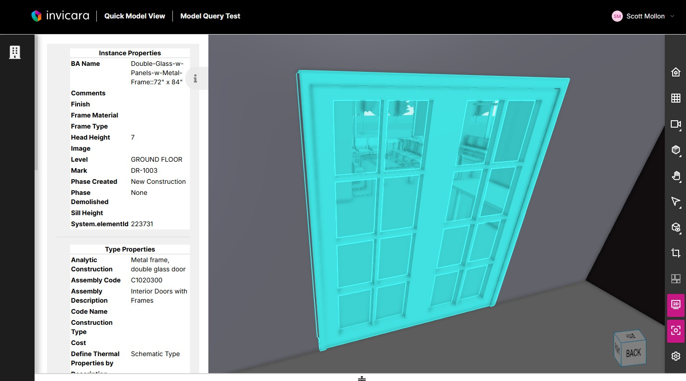

# How to View a Model and Model Element Properties

Follow the links for Tutorials on how to:

* [View a Model](#view-a-model)
* [View Selected Element Properties](#view-selected-element-properties)
* [Search Model Elements](search-model-elements)
* [Interact with the Element Table](interact-with-the-element-table)
* [Download the Element Table to Excel](download-the-element-table-to-excel)

## View a Model

1. Select the Model View page

2. Select a model in the Select a Model dropdown. If there is only one imported model in the project it will be automatically selected

> **Note**: If the Select a Model dropdown does not appear, or if the dropdown is empty, then most likely a model has not yet been imported. See [How to Import a Model](./importmodel.md).

3. The selected model will load in the viewer

## View Selected Element Properties

1. Click on an element in the model
2. Click the (i) Element drawer to expand it and view the element properties

> The Element drawer can be resized by dragging the right edge.

## Search Model Elements

1. Expand the Search drawer

> The Search drawer can be resized by dragging the right edge.

> **Note**: If you see this message in the search drawer, contact one of your project Admins and ask that they search enable the model following the [Migration User Guide](../migrationguide/migrate.md).
>
> 

2. Select from the list of type and instance properties found in the model. **Hint**: the dropdown is searchable

The properties you choose can be used to filter model elements in the next step and will appear as columns in Element table. 

3. You can select from the properties you chose above to create a search filter. Selecting a property from the Filter Elements dropdown will add a new unconfigured filter for that property.

> Currently only text and number properties are supported for creating search filters. [Click here](./searchfilters.md) to learn more about supported search filters and how to configure them.

4. Configure your filter and click Save

The count of elements that match the filter will update after saving the filter.

5. Once you have all your filters configured and saved, click the Search button

When the search completes the model viewer will update to isolate the searched elements from the rest of the model. You can continue to interact with the elements by clicking on them to view their properties.

## Interact with the Element Table

1. Once you have searched for model elements, you can view details for those elements by dragging the bottom panel up to view the element table

2. Clicking on a row will expand the row and display all of the element properties, clicking it again will collapse the element details

3. Clicking a column heading will sort the table by that column

4. Selecting an element in the model view will highlight the corresponding row in the table

5. Clicking a circle in the left column of the element table will select that element in the model view

> Hint: sorting by the first column of the table will keep the currently selected element row at the top of the first page of table data. This can be helpful when table contains many pages of data.

6. Adding or removing selected properties will update the table columns, without the need to perform another search.

## Download the Element Table to Excel

1. Once you have the element table configured with your desired properties click the green download button to save the current state of the table to an Excel xlsx file.

---
[Quick Model View User Guide](./README.md) < Back | Next > [How to Invite Users to a Quick Model View Project](./inviteusers.md)