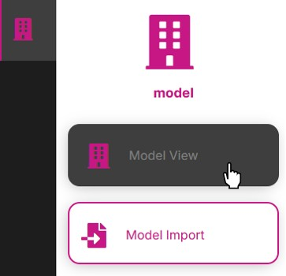

# How to View a Model and Model Element Properties

1. Select the Model View page

2. Select a model in the Select a Model dropdown

> **Note**: If the Select a Model dropdown does not appear, or if the dropdown is empty, then most likely a model has not yet been imported. See [How to Import a Model](./importmodel.md).

3. The selected model will load in the viewer

4. Click on an element in the model and the element properties will display in the panel on the right

---
[Quick Model View User Guide](./README.md) < Back | Next > [How to Invite Users to a Quick Model View Project](./inviteusers.md)